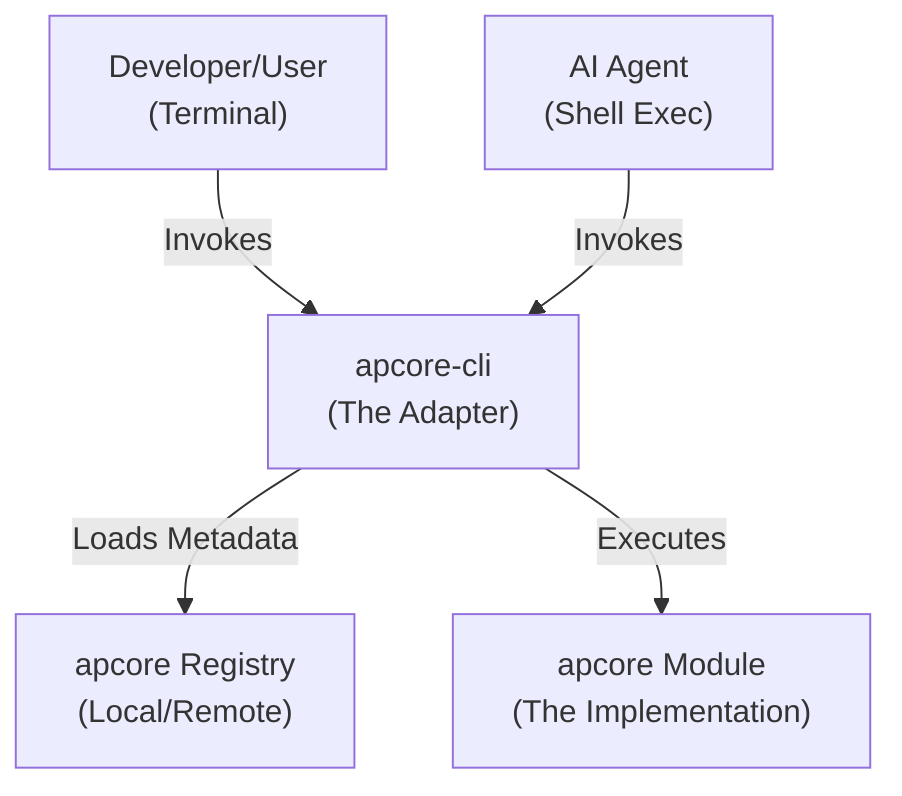
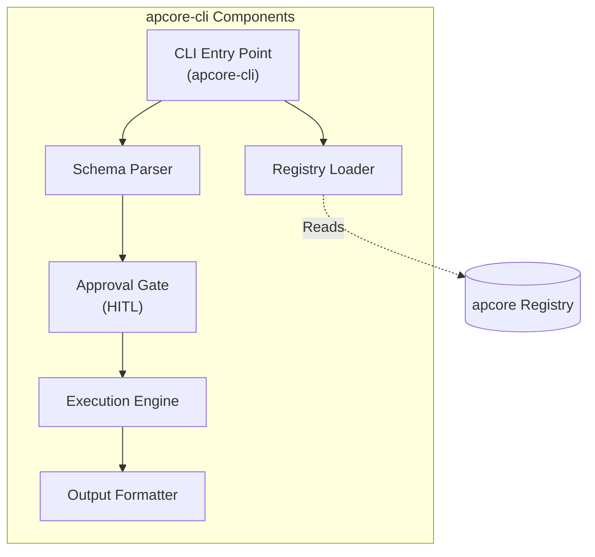
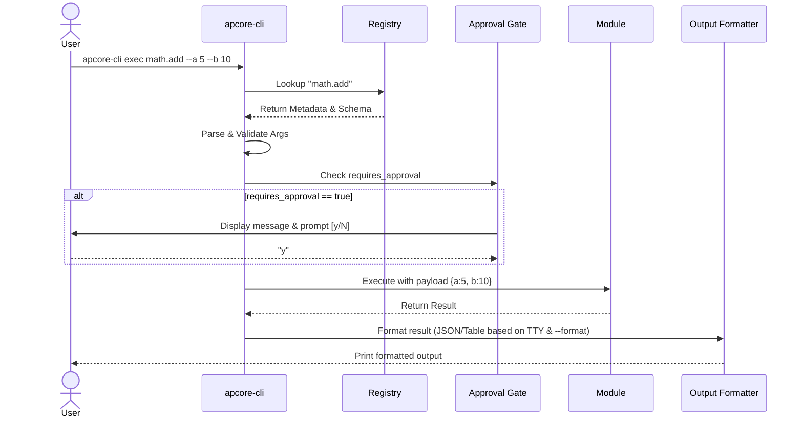

# Technical Design: apcore-cli (CLI Adapter)

---

## 1. Document Information

| Field | Value |
|-------|-------|
| **Document Title** | Technical Design: apcore-cli |
| **Version** | 0.4 |
| **Author** | Spec Forge |
| **Date** | 2026-03-14 |
| **Status** | Draft |
| **Related Idea** | [ideas/draft.md](../ideas/draft.md) |

---

## 2. Revision History

| Version | Date | Author | Description |
|---------|------|--------|-------------|
| 0.1 | 2026-03-14 | Spec Forge | Initial draft |
| 0.2 | 2026-03-14 | Spec Forge | Added Solution B, Naming Conventions, Sequence Diagram, and Error Taxonomy |
| 0.3 | 2026-03-14 | Spec Forge | Aligned error codes with apcore PROTOCOL_SPEC §8, unified environment variables, added Output Formatter component |
| 0.4 | 2026-03-14 | Spec Forge | CLI command name decision: `apcore-cli` (ADR-02), Executor integration strategy (ADR-03) |

---

## 3. Overview

### 3.1 Background
The `apcore` ecosystem currently lacks a standard CLI interface for invoking modules. Developers and AI Agents need a low-overhead, terminal-native way to execute "AI-Perceivable" modules. `apcore-cli` acts as an adapter, mapping the 3-layer `apcore` metadata model (Discovery, Capabilities, Execution) to a standard CLI structure.

### 3.2 Goals
- **Auto-Mapping**: Zero-config generation of CLI commands from `apcore` Module schemas.
- **Efficiency**: Minimal overhead (<100ms) for one-shot executions.
- **Safety**: Built-in HITL (Human-in-the-Loop) for destructive or sensitive operations.
- **Composability**: Seamless integration with Unix pipes and standard shell tools.

### 3.3 Non-Goals
- Remote execution via `apcore-a2a` (Deferred to Phase 4).
- Replacement for `apcore-mcp` (They are complementary).

---

## 4. System Context



---

## 5. Solution Design

### 5.1 Solution A: Dynamic Click Mapping (Recommended)

**Description:**
Use the `click` library in Python to dynamically build a command tree. A `CommandGroup` subclass will override `get_command` and `list_commands` to lazily load and map `apcore` modules from the Registry.

**Pros:**
- Highly extensible and idiomatic for Python.
- Minimal boilerplate; new modules appear in the CLI automatically.
- Excellent support for help text and nested subcommands.

**Cons:**
- Slight latency penalty for large registries if not indexed.

### 5.2 Solution B: Custom Argparse Wrapper

**Description:**
Build a custom wrapper around Python's built-in `argparse`. The registry would be pre-processed to generate a static (or semi-static) subcommand structure.

**Pros:**
- Zero external dependencies for the parser (using stdlib).
- Potentially faster startup time (<50ms).

**Cons:**
- Significantly more complex to maintain dynamic subcommand mapping.
- Poor support for complex help formatting and interactive prompts compared to `click`.

### 5.3 Comparison Matrix

| Criteria | Solution A (Click) | Solution B (Argparse) |
|----------|-------------------|-----------------------|
| Complexity | Low | High |
| Performance | High (<100ms) | Very High (<50ms) |
| Extensibility | Very High | Medium |
| DX (Help/TTY) | Excellent | Basic |

**Decision**: **Solution A** is recommended for its superior developer experience and ease of dynamic command generation, which outweighs the marginal performance gain of Solution B.

### 5.4 Architecture Decision Records

#### ADR-01: Dynamic Click Mapping (Solution A)

See §5.1–5.3 above. Decision: use `click` over `argparse`.

#### ADR-02: CLI Command Name — `apcore-cli`

**Context:**
The early SPEC draft used `ap` as the command name without formal justification. This created three problems:

1. **Ecosystem inconsistency** — All other adapters use their full package name as the command: `apcore-mcp`, `apcore-a2a`, `apexe`. Only `apcore-cli` → `ap` broke this pattern.
2. **Confusion with `apexe`** — `ap` (apcore-cli) and `apexe` (the executable scanner) could be confused. They do opposite things: `apexe` brings external CLI executables INTO apcore, `apcore-cli` exposes apcore modules OUT to the terminal.
3. **Collision risk** — `ap` is a 2-letter generic name; multi-language implementations (Python, TypeScript) would fight for the same global command name.

**Decision:** The CLI command name is **`apcore-cli`**, matching the package name.

```toml
[project.scripts]
apcore-cli = "apcore_cli.__main__:main"
```

**Rationale:**
- Consistent with ecosystem: `apcore-mcp`, `apcore-a2a`, `apexe` all use package name = command name.
- Unambiguous: `apexe scan git` (executable scanner) vs `apcore-cli exec math.add` (module executor) — no confusion.
- Multi-language safe: Python installs `apcore-cli` in venv, TypeScript installs in `node_modules/.bin/apcore-cli` — standard isolation, no collision.
- Users who want a shorter alias can set `alias ap="apcore-cli"` in their shell profile.

**Alternatives Rejected:**
- `ap` — Unjustified short name, breaks ecosystem pattern.
- `apcore` — Reserved as module ID prefix (PROTOCOL_SPEC §2.5); claiming the brand name for one adapter is disproportionate.

#### ADR-03: Executor Integration Strategy

**Context:**
`apcore-mcp` uses `Executor.call_async()` to execute modules (ADR-02 in apcore-mcp). `apcore-a2a` follows the same pattern. The CLI adapter must decide how to integrate with the apcore execution pipeline.

**Decision:** Use apcore's `Executor` directly. Support both creating an internal Executor (from Registry) and accepting a pre-configured Executor (for programmatic use).

```python
# Standalone mode (CLI entry point)
registry = Registry("./extensions")
registry.discover()
executor = Executor(registry)

# Programmatic mode (library use)
def create_cli(executor: Executor) -> click.Group:
    ...
```

**Rationale:**
- Preserves the full apcore execution pipeline: middleware chain, ACL enforcement, observability, and approval handling.
- Consistent with apcore-mcp (FR-EXEC-005/006) and apcore-a2a, which both support pre-configured Executor passthrough.
- CLI is a one-shot synchronous process — use `Executor.call()` (sync) rather than `call_async()` for simplicity. If async modules are encountered, `Executor.call()` internally handles the bridge via `asyncio.run()`.

---

## 6. Architecture Design

### 6.1 Container Diagram



### 6.2 Sequence Diagram: `apcore-cli exec` Lifecycle



---

## 7. Technology Stack & Conventions

### 7.1 Technology Stack

| Layer | Technology | Rationale |
|-------|-----------|-----------|
| Language | Python >= 3.11 | Aligned with apcore ecosystem minimum (apcore >= 0.13.0 requires Python >= 3.11). |
| CLI Framework | `click` | Powerful, modular, and supports dynamic command generation. |
| Validation | `jsonschema` | Native support for `apcore` schema validation. |
| Formatting | `rich` | For beautiful terminal output (tables, JSON syntax highlighting). |
| Distribution | `poetry` / `pip` | Standard Python packaging. |

### 7.2 Naming Conventions

| Element | Convention | Example |
|---------|-----------|---------|
| CLI Commands | kebab-case | `apcore-cli exec`, `apcore-cli list` |
| CLI Flags | --kebab-case | `--input-file`, `--dry-run` |
| Environment Variables | APCORE_{SECTION}_{KEY} | `APCORE_EXTENSIONS_ROOT`, `APCORE_CLI_AUTO_APPROVE` |
| Internal Modules | snake_case | `schema_parser.py` |

---

## 8. Detailed Design

### 8.1 Error Taxonomy

Error codes are aligned with [apcore PROTOCOL_SPEC §8](../../apcore/PROTOCOL_SPEC.md). The CLI maps framework error codes to Unix exit codes for shell integration.

| apcore Error Code | Exit Code | Description | Retryable |
|-------------------|-----------|-------------|-----------|
| `MODULE_NOT_FOUND` | 44 | The requested module ID is not in the registry. | No |
| `MODULE_LOAD_ERROR` | 44 | Module found in registry but failed to load (import error, missing entry_point). | No |
| `MODULE_DISABLED` | 44 | Module exists but is disabled. | No |
| `SCHEMA_VALIDATION_ERROR` | 45 | Input arguments do not match the module's JSON Schema. | No |
| `SCHEMA_CIRCULAR_REF` | 48 | Circular `$ref` detected in module's JSON Schema. | No |
| `APPROVAL_DENIED` | 46 | User explicitly rejected the HITL approval prompt. | No |
| `APPROVAL_TIMEOUT` | 46 | Approval prompt timed out (60s default in TTY). | Yes |
| `APPROVAL_PENDING` | 46 | Non-TTY environment, approval required but no bypass provided. | No |
| `CONFIG_NOT_FOUND` | 47 | Could not find the `apcore` extensions directory or config file. | No |
| `CONFIG_INVALID` | 47 | Configuration file is malformed or unparseable. | No |
| `MODULE_EXECUTE_ERROR` | 1 | The module implementation returned an error. | Depends |
| `MODULE_TIMEOUT` | 1 | Module execution timed out. | Yes |
| `EXECUTION_CANCELLED` | 130 | Execution interrupted by user (Ctrl+C / SIGINT). | Yes |
| `ACL_DENIED` | 77 | Permission denied by ACL rules. | No |
| `GENERAL_INVALID_INPUT` | 2 | Invalid CLI input (e.g., STDIN exceeds 10MB limit). | No |

### 8.2 Edge Case Handling

| Scenario | Behavior |
|----------|----------|
| Registry Missing | Fail with `CONFIG_NOT_FOUND` (exit 47). Suggest `APCORE_EXTENSIONS_ROOT` or default location. |
| Non-TTY Approval | Fail with `APPROVAL_PENDING` (exit 46) unless `--yes` flag or `APCORE_CLI_AUTO_APPROVE=1` is set. |
| Circular Schemas | Detect and fail with `SCHEMA_CIRCULAR_REF` (exit 48) during parsing. Max `$ref` depth: 32. |
| STDIN > 10MB | Reject with `GENERAL_INVALID_INPUT` (exit 2) unless `--large-input` is set. |

### 8.3 Environment Variables

All environment variables follow the apcore naming convention: `APCORE_{SECTION}_{KEY}` (PROTOCOL_SPEC §9.2).

| Variable | Description | Default |
|----------|-------------|---------|
| `APCORE_EXTENSIONS_ROOT` | Path to `apcore` extensions directory. | `./extensions` |
| `APCORE_CLI_AUTO_APPROVE` | Set to `1` to bypass all HITL approval prompts. Admin only. | _(unset)_ |
| `APCORE_LOGGING_LEVEL` | Log level: `DEBUG`, `INFO`, `WARN`, `ERROR`. | `INFO` |

**Override Priority** (per PROTOCOL_SPEC §9.2):
1. CLI flag (highest): `--extensions-dir`, `--yes`, `--log-level`
2. Environment variable: `APCORE_EXTENSIONS_ROOT`, etc.
3. Configuration file: `apcore.yaml`
4. Default value (lowest)

### 8.4 Observability

- **Logging**: Use standard Python `logging` with namespace `apcore_cli`.
  - `DEBUG`: Full schema parsing traces and raw JSON payloads.
  - `INFO`: Execution status and timing.
  - `ERROR`: Module execution failures (sanitized, no stack traces to terminal).
- **Telemetry**: (None for MVP) - Ensure privacy for Agent interactions.

### 8.5 Package Entry Point

```toml
[project.scripts]
apcore-cli = "apcore_cli.__main__:main"
```

Also supports `python -m apcore_cli` for environments where console scripts are not installed.
