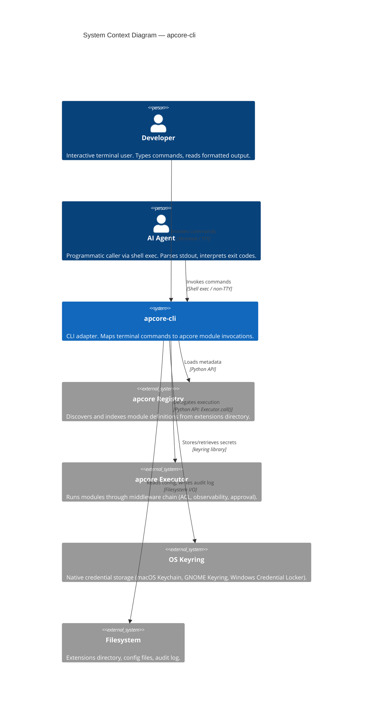
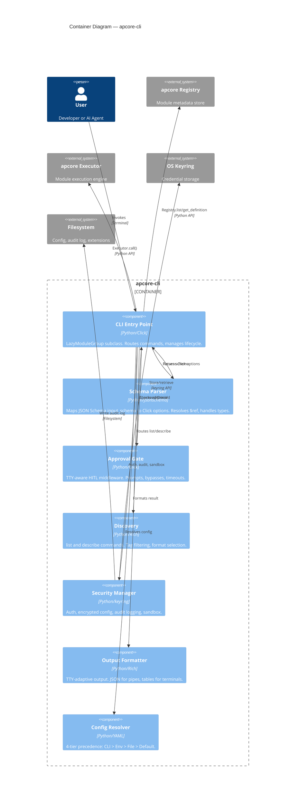
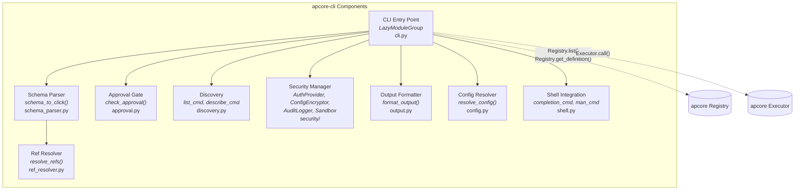
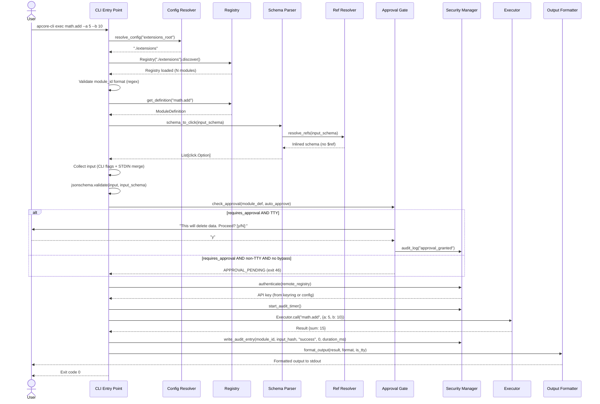
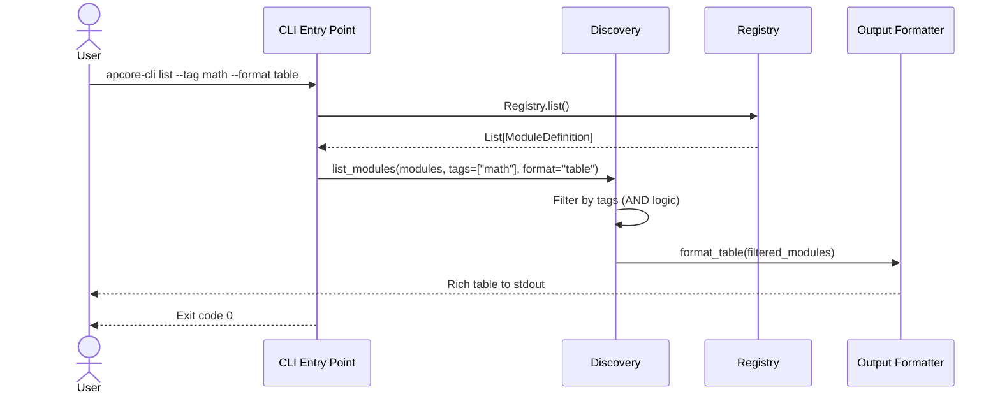
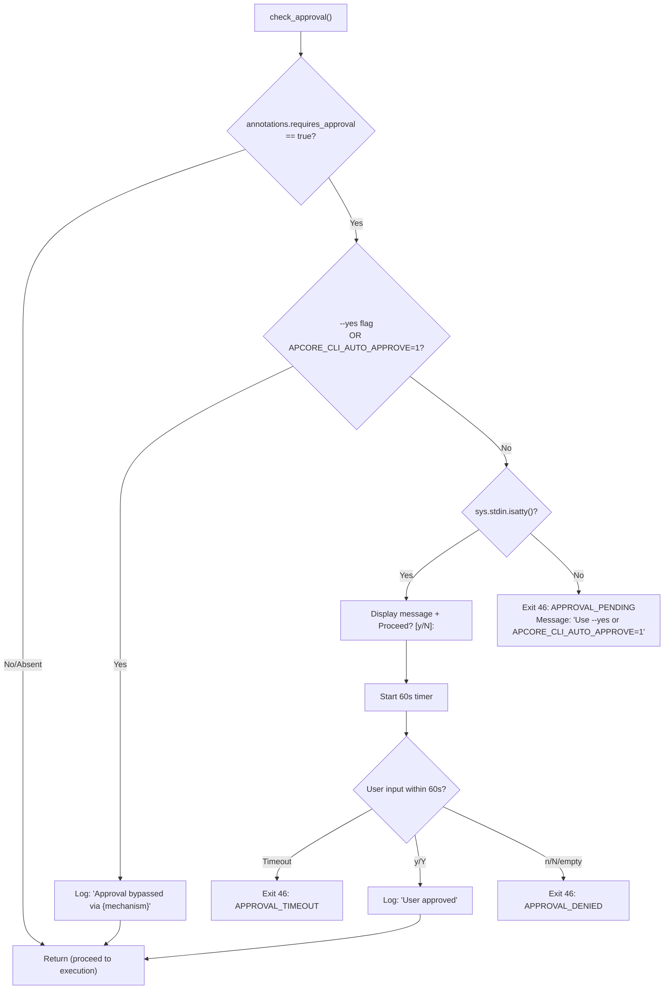

# Technical Design: apcore-cli

---

## 1. Document Information

| Field | Value |
|-------|-------|
| **Document Title** | Technical Design: apcore-cli |
| **Version** | 1.0 |
| **Author** | Spec Forge |
| **Date** | 2026-03-14 |
| **Status** | Draft |
| **Supersedes** | Tech Design v0.4 (`docs/tech-design-apcore-cli.md`) |
| **Upstream SRS** | `docs/srs.md` (SRS-APCORE-CLI-001 v0.1) |

---

## 2. Revision History

| Version | Date | Author | Description |
|---------|------|--------|-------------|
| 1.0 | 2026-03-14 | Spec Forge | Full rewrite from SRS. Supersedes v0.4. Adds security stack, shell integration, C4 diagrams, traceability matrix. |

---

## 3. Overview

### 3.1 Background

The `apcore` ecosystem provides a protocol for building AI-Perceivable modules with a 3-layer metadata model (Discovery, Capabilities, Execution). Currently, developers and AI agents lack a standard, low-overhead terminal interface for invoking these modules. `apcore-cli` is a CLI adapter that bridges this gap, translating terminal commands into apcore module invocations.

### 3.2 Goals

1. **Auto-Mapping**: Zero-config generation of CLI commands from `apcore` Module JSON Schema definitions (SRS FR-SCHEMA-001 through FR-SCHEMA-006).
2. **Efficiency**: < 100ms CLI startup time, < 50ms adapter overhead excluding module execution (SRS NFR-PERF-001, NFR-PERF-002).
3. **Safety**: TTY-aware Human-in-the-Loop approval gates for destructive or sensitive operations (SRS FR-APPR-001 through FR-APPR-005).
4. **Composability**: Unix pipe integration via STDIN JSON input and TTY-adaptive output formatting (SRS FR-DISP-004, FR-DISC-004).
5. **Security**: Full authentication, encrypted config, audit logging, and sandboxed execution stack (SRS FR-SEC-001 through FR-SEC-004).

### 3.3 Non-Goals

- Remote execution via `apcore-a2a` (deferred to Phase 4).
- Replacement for `apcore-mcp` (they are complementary adapters).
- GUI or TUI dashboard for module management.

---

## 4. System Context (C4 Level 1)



### 4.1 Actors

| Actor | Type | Interaction Mode | Key Needs | SRS Reference |
|-------|------|------------------|-----------|---------------|
| Developer | Human | Interactive TTY | Descriptive help, readable errors, tab completion, approval prompts | SRS §4.3 |
| AI Agent | Programmatic | Non-TTY shell exec | Deterministic exit codes, structured JSON output, no interactive prompts | SRS §4.3 |
| CI/CD System | Automated | Non-TTY | Approval bypass via `--yes` or env var, deterministic behavior | SRS FR-APPR-004 |

---

## 5. Solution Design

### 5.1 Solution A: Dynamic Click Group with Lazy Loading (Recommended)

**Description:** Use a custom `click.Group` subclass that overrides `get_command()` and `list_commands()` to lazily load apcore modules from the Registry. Each module's `input_schema` is parsed at invocation time (not at startup) to generate Click options dynamically. The Executor is used for all module invocations.

**Architecture:**
- A `LazyModuleGroup` subclass of `click.Group` is the root command.
- On `list_commands()`, it returns the union of built-in subcommands (`exec`, `list`, `describe`, `completion`, `man`) and dynamically discovered module IDs.
- On `get_command(name)`, it resolves the module from the Registry, parses its `input_schema` via the Schema Parser, and returns a dynamically constructed `click.Command`.
- Module execution is delegated to `Executor.call(module_id, validated_input)`.

**Pros:**
- Highly extensible and idiomatic for Python CLI tooling.
- Minimal boilerplate; new modules appear automatically.
- Excellent help text, nested subcommand support, and interactive prompts via Click.
- Lazy loading ensures startup time is not proportional to module count.

**Cons:**
- External dependency on `click` (not stdlib).
- First invocation of a module has marginally higher latency due to schema parsing (mitigated by caching).

**Technology choices:**
- `click >= 8.1` for CLI framework.
- `jsonschema >= 4.20` for schema validation.
- `rich >= 13.0` for terminal output.
- `keyring >= 24.0` for encrypted credential storage.

### 5.2 Solution B: Static Argparse with Pre-compiled Command Registry

**Description:** Pre-process the extensions directory at install time or first run to generate a static subcommand manifest. Use Python's built-in `argparse` to construct a fixed command tree from the manifest. Re-scan on explicit `apcore-cli refresh` invocation.

**Architecture:**
- A `setup.py` or post-install hook scans the extensions directory and generates a `commands.json` manifest.
- At startup, `argparse` reads the manifest and constructs subparsers for each module.
- Schema changes require re-running `apcore-cli refresh` to regenerate the manifest.

**Pros:**
- Zero external dependencies for the parser (uses stdlib `argparse`).
- Potentially faster startup (< 50ms) due to pre-compiled manifest.
- Deterministic command set (no runtime surprises).

**Cons:**
- Manual refresh step breaks the zero-config promise (SRS §3.2: "zero manual configuration").
- Poor support for interactive prompts (no built-in `confirm()` equivalent; would require custom implementation for approval gate).
- Complex help formatting requires significant custom code.
- Boolean flag pairs (`--flag/--no-flag`) require manual implementation.
- Dynamic completion for module-specific flags is significantly harder.

### 5.3 Comparison Matrix

| Criteria | Weight | Solution A (Click) | Solution B (Argparse) |
|----------|--------|-------------------|-----------------------|
| **Zero-config compliance** (SRS §3.2) | 25% | Fully automatic. Modules appear on discovery. Score: 10 | Requires `refresh` step. Score: 4 |
| **Startup performance** (NFR-PERF-001: < 100ms) | 20% | < 100ms with lazy loading. Score: 8 | < 50ms with pre-compiled manifest. Score: 10 |
| **Approval gate support** (FR-APPR-002) | 15% | `click.confirm()` built-in. Score: 10 | Custom implementation required. Score: 5 |
| **Boolean flag pairs** (FR-SCHEMA-002) | 10% | Native `--flag/--no-flag` support. Score: 10 | Manual subparser configuration. Score: 4 |
| **Shell completion** (FR-SHELL-001) | 10% | Built-in completion framework. Score: 9 | Requires custom completion script. Score: 3 |
| **Help text quality** (NFR-USB-001) | 10% | Excellent formatting with groups, epilog. Score: 9 | Basic formatting only. Score: 5 |
| **Dependency count** | 5% | 1 external dep (click). Score: 7 | 0 external deps. Score: 10 |
| **Maintainability** | 5% | Well-documented, large community. Score: 9 | More custom code to maintain. Score: 5 |
| **Weighted Total** | 100% | **9.1** | **5.2** |

### 5.4 Decision

**Solution A (Dynamic Click Group with Lazy Loading)** is selected. The zero-config requirement (SRS §3.2), built-in approval prompts (FR-APPR-002), and boolean flag pair support (FR-SCHEMA-002) are strong differentiators that outweigh Solution B's marginal startup performance advantage.

This decision preserves and extends ADR-01 from Tech Design v0.4.

---

## 6. Architecture Decision Records

### ADR-01: CLI Framework — Click over Argparse/Typer

**Context:** The CLI adapter needs a framework that supports dynamic command generation, interactive prompts, boolean flag pairs, and shell completion.

**Decision:** Use `click >= 8.1` as the CLI framework.

**Rationale:** See §5.3 comparison matrix. Click's `click.Group` subclassing, `click.confirm()`, and `--flag/--no-flag` support directly satisfy SRS requirements FR-SCHEMA-002, FR-APPR-002, and FR-SHELL-001.

**Alternatives rejected:** `argparse` (too much custom code), `typer` (adds Pydantic dependency, less control over dynamic command generation).

### ADR-02: CLI Program Name — Default to Entry-Point, Not Hardcoded

**Context:** `apcore-cli` is both a standalone CLI tool and a reusable library. When downstream projects (e.g., `myproject`) add it as a dependency and publish their own entry-point script, help output and version output should display their project name, not the internal `apcore-cli` string.

**Decision:** The program name used in `--help` and `--version` output shall be resolved dynamically from `os.path.basename(sys.argv[0])` at startup rather than being hardcoded. An explicit `prog_name` parameter on `create_cli()` and `main()` provides override capability. The fallback when `argv[0]` is unavailable or empty is `apcore-cli`.

**Precedence (highest to lowest):**
1. Explicit `prog_name` parameter passed to `create_cli()` or `main()`.
2. `os.path.basename(sys.argv[0])` — the invoking entry-point script name.

**Rationale:** Downstream projects should be able to redistribute their CLI under a branded name with zero code changes. A project that installs its own entry-point `[project.scripts] myproject = "apcore_cli.__main__:main"` will automatically get `myproject --help` and `myproject, version X.Y.Z` without forking the source.

**Entry point (default, this package):**
```toml
[project.scripts]
apcore-cli = "apcore_cli.__main__:main"
```

**Downstream project entry point:**
```toml
# downstream_project/pyproject.toml
[project.scripts]
myproject = "apcore_cli.__main__:main"
# Result: `myproject --help` and `myproject, version X.Y.Z`
```

**Explicit override (programmatic):**
```python
from apcore_cli.__main__ import main
main(prog_name="myproject")
```

**Alternative rejected:** Hardcoding `"apcore-cli"` everywhere. This was the initial approach and was rejected because it breaks the library-use contract — downstream project users would see `apcore-cli` in their tool's help output even when the command they typed was `myproject`.

### ADR-03: Executor Integration — Direct Delegation

**Context:** The CLI must integrate with apcore's execution pipeline to preserve the middleware chain (ACL, observability, approval handling).

**Decision:** Use `Executor.call(module_id, validated_input)` for all module invocations. Support both standalone mode (create Executor from Registry) and programmatic mode (accept pre-configured Executor).

**Rationale:** Preserves the full apcore middleware chain. Consistent with `apcore-mcp` and `apcore-a2a`. The CLI is a synchronous one-shot process; `Executor.call()` (sync) is used rather than `call_async()`.

```python
# Standalone mode (CLI entry point)
registry = Registry("./extensions")
registry.discover()
executor = Executor(registry)
result = executor.call(module_id, validated_input)

# Programmatic mode (library use)
def create_cli(executor: Executor) -> click.Group:
    ...
```

### ADR-04: Encrypted Configuration — Keyring with AES-256-GCM Fallback

**Context:** Sensitive values (API keys, tokens) must not be stored in plaintext in config files (SRS FR-SEC-002, NFR-SEC-001).

**Decision:** Use the `keyring` library (>= 24.0) for OS-native credential storage as the primary mechanism. When the keyring is unavailable (headless servers, containers), fall back to AES-256-GCM encryption with a machine-derived key.

**Rationale:**
- `keyring` provides cross-platform support: macOS Keychain, GNOME Keyring / Secret Service, Windows Credential Locker.
- The AES-256-GCM fallback ensures functionality in headless environments where no keyring daemon is available.
- Machine-derived key uses `hostname + username + salt` to prevent portable decryption of stolen config files.

**Alternatives considered:**
- **SOPS (Mozilla):** Heavyweight, requires GPG or cloud KMS setup. Overkill for a CLI tool's local config.
- **python-dotenv with .env files:** No encryption; just obfuscation. Violates NFR-SEC-001.
- **Fernet (cryptography library):** Simpler API but AES-CBC mode; AES-256-GCM provides authenticated encryption with better security properties.

### ADR-05: Audit Logging — JSON Lines Format

**Context:** Every module execution must be logged for accountability and forensics (SRS FR-SEC-003).

**Decision:** Use append-only JSON Lines (`.jsonl`) format at `~/.apcore-cli/audit.jsonl`.

**Rationale:** JSON Lines is grep-friendly, append-only (no file corruption from concurrent writes), and parseable by standard tools (`jq`, `grep`, log aggregation systems). Each line is an independent JSON object, so partial writes don't corrupt the file.

### ADR-06: Execution Sandboxing — Subprocess with Restricted Environment

**Context:** Untrusted modules should be isolated from the host system (SRS FR-SEC-004).

**Decision:** Use `subprocess.Popen` with a restricted environment dictionary and a temporary working directory when `--sandbox` is active. The restricted environment includes only `PATH`, `PYTHONPATH`, `HOME` (set to temp dir), and explicitly allowed `APCORE_*` variables.

**Rationale:** Process-level isolation is portable across Linux, macOS, and Windows. It does not require elevated privileges or platform-specific APIs (unlike cgroups, AppArmor, or Windows AppContainer). For Phase 1, this provides defense-in-depth without operational complexity.

**Limitations:** This is not a security boundary against a determined adversary. The subprocess can still make network calls. Full containerization (Docker, Bubblewrap) is deferred to Phase 2.

---

## 7. Architecture Design

### 7.1 Container Diagram (C4 Level 2)



### 7.2 Component Diagram (C4 Level 3)



### 7.3 Sequence Diagram: `apcore-cli exec` Full Lifecycle



### 7.4 Sequence Diagram: Discovery — `apcore-cli list`



---

## 8. Detailed Design

### 8.1 Component Overview

| Component | Module Path | SRS Requirements | Priority | Feature Spec |
|-----------|-------------|------------------|----------|--------------|
| **Core Dispatcher** | `apcore_cli/cli.py` | FR-DISP-001 through FR-DISP-006 | P0 | `docs/features/core-dispatcher.md` |
| **Schema Parser** | `apcore_cli/schema_parser.py` | FR-SCHEMA-001 through FR-SCHEMA-006 | P0 | `docs/features/schema-parser.md` |
| **Approval Gate** | `apcore_cli/approval.py` | FR-APPR-001 through FR-APPR-005 | P1 | `docs/features/approval-gate.md` |
| **Discovery** | `apcore_cli/discovery.py` | FR-DISC-001 through FR-DISC-004 | P1 | `docs/features/discovery.md` |
| **Security Manager** | `apcore_cli/security/` | FR-SEC-001 through FR-SEC-004 | P1/P2 | `docs/features/security.md` |
| **Shell Integration** | `apcore_cli/shell.py` | FR-SHELL-001, FR-SHELL-002 | P2 | `docs/features/shell-integration.md` |
| **Config Resolver** | `apcore_cli/config.py` | FR-DISP-005 | P0 | `docs/features/config-resolver.md` |
| **Output Formatter** | `apcore_cli/output.py` | FR-DISC-004 | P1 | `docs/features/output-formatter.md` |

### 8.2 Core Dispatcher

#### 8.2.1 Class: `LazyModuleGroup`

**Purpose:** Custom `click.Group` subclass that lazily discovers and loads modules from the apcore Registry.

```python
class LazyModuleGroup(click.Group):
    """Custom Click Group that lazily loads apcore modules as subcommands."""

    def __init__(self, registry: Registry, executor: Executor, **kwargs):
        super().__init__(**kwargs)
        self._registry = registry
        self._executor = executor
        self._module_cache: dict[str, click.Command] = {}

    def list_commands(self, ctx: click.Context) -> list[str]:
        """Return built-in commands + discovered module IDs."""
        builtin = ["exec", "list", "describe", "completion", "man"]
        module_ids = [m.canonical_id for m in self._registry.list()]
        return sorted(set(builtin + module_ids))

    def get_command(self, ctx: click.Context, cmd_name: str) -> click.Command | None:
        """Resolve a command by name. For module IDs, dynamically build a Click command."""
        if cmd_name in self.commands:
            return self.commands[cmd_name]
        if cmd_name in self._module_cache:
            return self._module_cache[cmd_name]
        # Attempt module resolution
        module_def = self._registry.get_definition(cmd_name)
        if module_def is None:
            return None
        cmd = build_module_command(module_def, self._executor)
        self._module_cache[cmd_name] = cmd
        return cmd
```

**Traces to:** FR-DISP-001 (base command entry point), FR-DISP-002 (module execution).

#### 8.2.2 Function: `build_module_command`

```python
def build_module_command(module_def: ModuleDefinition, executor: Executor, help_text_max_length: int = 1000) -> click.Command:
    """Build a Click Command from a module definition."""
    input_schema = module_def.input_schema
    resolved_schema = resolve_refs(input_schema, max_depth=32)
    options = schema_to_click_options(resolved_schema)

    @click.command(name=module_def.canonical_id, help=module_def.description)
    @click.option("--input", "stdin_input", type=click.STRING, default=None,
                  help="Read JSON input from STDIN. Use '-' for piped input.")
    @click.option("--yes", "auto_approve", is_flag=True, default=False,
                  help="Bypass approval prompts.")
    @click.option("--large-input", is_flag=True, default=False,
                  help="Allow STDIN input exceeding 10MB.")
    @click.pass_context
    def command(ctx, stdin_input, auto_approve, large_input, **kwargs):
        # 1. Collect input (merge STDIN + CLI flags)
        merged = collect_input(stdin_input, kwargs, large_input)
        # 2. Validate against schema
        validate_input(merged, resolved_schema)
        # 3. Check approval
        check_approval(module_def, auto_approve)
        # 4. Execute
        audit_start = time.monotonic()
        result = executor.call(module_def.canonical_id, merged)
        duration_ms = int((time.monotonic() - audit_start) * 1000)
        # 5. Audit log
        write_audit_entry(module_def.canonical_id, merged, "success", 0, duration_ms)
        # 6. Output
        format_output(result, ctx)

    for opt in options:
        command.params.append(opt)
    return command
```

**Traces to:** FR-DISP-002 (module execution), FR-DISP-004 (STDIN input), FR-SCHEMA-001 (flag generation).

#### 8.2.3 STDIN Input Collection

**Function:** `collect_input(stdin_flag: str | None, cli_kwargs: dict, large_input: bool) -> dict`

| Parameter | Type | Validation | Boundary Values | SRS Reference |
|-----------|------|------------|----------------|---------------|
| `stdin_flag` | `str \| None` | If `"-"`, read STDIN. If `None`, skip STDIN. | Empty string treated as None. | FR-DISP-004 |
| `cli_kwargs` | `dict` | Keys must be valid Python identifiers. Values from Click type coercion. | Empty dict is valid. | FR-DISP-002 |
| `large_input` | `bool` | Boolean flag. | `True` disables 10MB limit. | FR-DISP-004 AF-6 |

**STDIN buffer limits:**
- Default max: 10 MB (10,485,760 bytes). Reject with exit code 2 if exceeded without `--large-input`.
- With `--large-input`: No limit (read until EOF).
- Empty STDIN (0 bytes) when `--input -` is specified: treat as `{}`.

**Merge precedence:** CLI flags override STDIN values for duplicate keys (SRS FR-DISP-004 Main Flow step 4).

**Edge cases:**
- STDIN is a JSON array: exit code 2, message "STDIN JSON must be an object, got array."
- STDIN is a JSON primitive (string, number, boolean, null): exit code 2, message "STDIN JSON must be an object, got {type}."
- STDIN is invalid JSON: exit code 2, message includes parse error detail.
- STDIN without `--input -`: ignored entirely.

#### 8.2.4 Module ID Validation

**Regex:** `^[a-z][a-z0-9_]*(\.[a-z][a-z0-9_]*)*$`

| Input | Valid? | Exit Code |
|-------|--------|-----------|
| `math.add` | Yes | — |
| `text.summarize` | Yes | — |
| `a` | Yes | — |
| `a.b.c.d` | Yes | — |
| `MATH.ADD` | No | 2 |
| `math-add` | No | 2 |
| `.math` | No | 2 |
| `math.` | No | 2 |
| `123.add` | No | 2 |
| `a` * 129 | No (> 128 chars) | 2 |
| Empty string | No | 2 |

**Traces to:** FR-DISP-002 AF-2.

### 8.3 Schema Parser

#### 8.3.1 Function: `schema_to_click_options`

**Signature:** `schema_to_click_options(schema: dict) -> list[click.Option]`

**Purpose:** Convert a resolved (no `$ref`) JSON Schema `properties` dict into a list of Click options.

**Type mapping table:**

| JSON Schema `type` | Click Type | Notes | SRS Reference |
|--------------------|-----------|-------|---------------|
| `"string"` | `click.STRING` | Default for unknown types. | FR-SCHEMA-001 |
| `"integer"` | `click.INT` | Strict integer parsing. | FR-SCHEMA-001 |
| `"number"` | `click.FLOAT` | Accepts both int and float. | FR-SCHEMA-001 |
| `"boolean"` | `is_flag=True` | `--flag/--no-flag` pair. | FR-SCHEMA-002 |
| `"object"` | `click.STRING` | Expects JSON string; parsed at validation. | FR-SCHEMA-001 |
| `"array"` | `click.STRING` | Expects JSON string; parsed at validation. | FR-SCHEMA-001 |
| Unknown / missing | `click.STRING` | Log WARNING. | FR-SCHEMA-001 AF-1, AF-2 |

**Property name to flag name conversion:**
- Replace underscores with hyphens: `input_file` -> `--input-file`
- Prefix with `--`: `name` -> `--name`

**Collision detection:** If two properties map to the same flag name after underscore-to-hyphen conversion (e.g., `input_file` and `input-file` both map to `--input-file`), exit with code 48 and a diagnostic message identifying both property names.

**Traces to:** FR-SCHEMA-001, FR-SCHEMA-002, FR-SCHEMA-003, FR-SCHEMA-004, FR-SCHEMA-005.

#### 8.3.2 Enum Handling

When a property has an `enum` field:
1. Convert all enum values to strings: `[str(v) for v in enum_values]`.
2. Create `click.Option` with `type=click.Choice(string_values)`.
3. After Click parses the value, reconvert to the original type if the enum contained non-string types (e.g., integers).

| Scenario | Behavior | SRS Reference |
|----------|----------|---------------|
| `enum: ["json", "csv"]` | `click.Choice(["json", "csv"])` | FR-SCHEMA-003 |
| `enum: [1, 2, 3]` | `click.Choice(["1", "2", "3"])`, reconvert to int | FR-SCHEMA-003 AF-2 |
| `enum: []` | Treat as regular string, log WARNING | FR-SCHEMA-003 AF-1 |
| `enum: [true]` on boolean type | Standard boolean flag, ignore enum | FR-SCHEMA-002 AF-1 |

#### 8.3.3 Required Property Enforcement

1. Read `required` array from `input_schema`.
2. For each property name in `required`, set `required=True` on the corresponding `click.Option`.
3. If a required property name is not in `properties`, log WARNING and skip.
4. Required properties satisfied by STDIN merge are validated post-merge, not at Click parsing time. This means required flags are set to `required=False` when `--input -` is used, and validation is deferred to `jsonschema.validate()`.

**Traces to:** FR-SCHEMA-004.

#### 8.3.4 Help Text Generation

| Priority | Source Field | Behavior | SRS Reference |
|----------|-------------|----------|---------------|
| 1 (highest) | `x-llm-description` | Use if present and non-empty string. | FR-SCHEMA-005 |
| 2 | `description` | Use if `x-llm-description` is absent/empty. | FR-SCHEMA-005 |
| 3 (default) | None | `help=None` (Click shows no help text). | FR-SCHEMA-005 |

**Truncation:** Help text is passed to the CLI framework as-is for natural line wrapping. A configurable safety ceiling applies (default: 1000 characters via `cli.help_text_max_length`): text beyond this limit is truncated to `(limit - 3)` characters + `"..."`. Full description available via `apcore-cli describe <module_id>`.

**Traces to:** FR-SCHEMA-005.

#### 8.3.5 Reference Resolution

**Function:** `resolve_refs(schema: dict, max_depth: int = 32) -> dict`

**Algorithm:**
1. Walk the schema tree depth-first.
2. Maintain a `visited: set[str]` of resolved `$ref` targets and a `depth: int` counter.
3. For each `$ref` encountered:
   a. Increment depth. If depth > 32, exit code 48: "depth exceeded maximum of 32."
   b. Check if target is in `visited`. If so, exit code 48: "Circular $ref detected."
   c. Resolve the reference from `$defs`. If target not found, exit code 45: "Unresolvable $ref."
   d. Add target to `visited`. Inline the resolved schema.
4. For `allOf`: merge all sub-schemas' `properties` and `required` arrays (union).
5. For `anyOf`/`oneOf`: merge all sub-schema properties (union); only mark properties as required if they appear in ALL sub-schemas' `required` arrays (intersection).
6. Return fully inlined schema with no `$ref`, `$defs`, `allOf`, `anyOf`, `oneOf` remaining.

| Input | Expected Behavior | Exit Code | SRS Reference |
|-------|-------------------|-----------|---------------|
| `$ref: "#/$defs/Addr"` with valid `$defs.Addr` | Inline Addr properties | — | FR-SCHEMA-006 |
| Circular: A -> B -> A | Error: "Circular $ref detected" | 48 | FR-SCHEMA-006 AF-1 |
| Depth = 33 | Error: "depth exceeded maximum of 32" | 48 | FR-SCHEMA-006 AF-2 |
| `$ref: "#/$defs/Missing"` | Error: "Unresolvable $ref" | 45 | FR-SCHEMA-006 AF-3 |
| `allOf: [{props: {a}}, {props: {b}}]` | Merged: `{props: {a, b}}` | — | FR-SCHEMA-006 |
| `anyOf: [{req: [a]}, {req: [b]}]` | Required: `[]` (intersection is empty) | — | FR-SCHEMA-006 |

**Traces to:** FR-SCHEMA-006.

### 8.4 Approval Gate

#### 8.4.1 Function: `check_approval`

**Signature:** `check_approval(module_def: ModuleDefinition, auto_approve: bool) -> None`

**Flow:**



**Parameter validation:**

| Parameter | Type | Validation | Edge Cases |
|-----------|------|------------|------------|
| `module_def.annotations` | `dict \| None` | If None, skip approval gate entirely. | Module with no annotations field. |
| `module_def.annotations.requires_approval` | `bool \| None` | Must be exactly `True` (boolean). Any other type or value: skip. | `"true"` string: skip. `1` integer: skip. `None`: skip. |
| `auto_approve` | `bool` | From `--yes` flag. | Always checked first (highest priority). |
| `APCORE_CLI_AUTO_APPROVE` env var | `str` | Must be exactly `"1"`. Other values: log WARNING and ignore. | `"true"`: WARNING logged, not treated as bypass. `"0"`: not bypass. `""`: not bypass. |

**Timeout implementation:** Use `signal.alarm(60)` on Unix. On Windows (where `signal.alarm` is unavailable), use a threading timer that sends `KeyboardInterrupt` to the main thread after 60 seconds.

**Traces to:** FR-APPR-001 through FR-APPR-005.

### 8.5 Discovery

#### 8.5.1 Command: `list`

**Signature:** `apcore-cli list [--tag TAG]... [--format {table|json}]`

| Parameter | Type | Default | Validation | SRS Reference |
|-----------|------|---------|------------|---------------|
| `--tag` | `str` (multiple) | None (no filter) | Each tag: `^[a-z][a-z0-9_-]*$`. Invalid tags: exit code 2. | FR-DISC-002 |
| `--format` | `click.Choice(["table", "json"])` | TTY-adaptive: `table` if `stdout.isatty()`, else `json`. | Click validates. Invalid: exit code 2. | FR-DISC-004 |

**Table columns:**

| Column | Source | Max Width | Truncation |
|--------|--------|-----------|------------|
| ID | `module.canonical_id` | 128 chars | No (IDs are max 128) |
| Description | `module.description` | 80 chars | Append `...` if > 80 |
| Tags | `", ".join(module.tags)` | Unlimited | No |

**Filtering logic:** AND semantics. A module is included only if `set(specified_tags).issubset(set(module.tags))`.

**Empty results:** Display table headers with note "No modules found." (or "No modules found matching tags: math, core."). Exit code 0.

**JSON output format:**
```json
[
  {
    "id": "math.add",
    "description": "Add two numbers.",
    "tags": ["math", "core"]
  }
]
```

**Traces to:** FR-DISC-001, FR-DISC-002, FR-DISC-004.

#### 8.5.2 Command: `describe`

**Signature:** `apcore-cli describe <module_id> [--format {table|json}]`

| Parameter | Type | Validation | SRS Reference |
|-----------|------|------------|---------------|
| `module_id` | `str` (positional) | Canonical ID regex. Max 128 chars. | FR-DISC-003 |
| `--format` | `click.Choice(["table", "json"])` | TTY-adaptive default. | FR-DISC-004 |

**Table output sections:**
1. **Core**: Module ID, full description, input_schema (syntax-highlighted JSON via `rich.syntax.Syntax`), output_schema (syntax-highlighted JSON).
2. **Annotations**: `requires_approval`, `readonly`, `destructive`, `idempotent` (only if present).
3. **Extension metadata**: All `x-` prefixed fields (only if present).

**JSON output format:**
```json
{
  "id": "math.add",
  "description": "Add two numbers.",
  "input_schema": {"properties": {"a": {"type": "integer"}, "b": {"type": "integer"}}, "required": ["a", "b"]},
  "output_schema": {"properties": {"sum": {"type": "integer"}}},
  "annotations": {"requires_approval": false, "readonly": true},
  "tags": ["math", "core"],
  "x-when-to-use": "When you need to add two integers."
}
```

**Traces to:** FR-DISC-003, FR-DISC-004.

### 8.6 Security Manager

The Security Manager is organized as a sub-package with four components:

```
apcore_cli/security/
├── __init__.py          # Exports: AuthProvider, ConfigEncryptor, AuditLogger, Sandbox
├── auth.py              # API key authentication
├── config_encryptor.py  # Keyring + AES-256-GCM fallback
├── audit.py             # JSON Lines audit logging
└── sandbox.py           # Subprocess isolation
```

#### 8.6.1 AuthProvider (FR-SEC-001)

**Class:** `AuthProvider`

```python
class AuthProvider:
    """Resolves and provides API key authentication for remote registries."""

    def __init__(self, config: ConfigResolver):
        self._config = config

    def get_api_key(self) -> str | None:
        """Resolve API key from config precedence."""
        return self._config.resolve("auth.api_key",
                                     cli_flag="--api-key",
                                     env_var="APCORE_AUTH_API_KEY")

    def authenticate_request(self, headers: dict) -> dict:
        """Add Authorization header to HTTP request headers."""
        key = self.get_api_key()
        if key is None:
            raise AuthenticationError(
                "Remote registry requires authentication. "
                "Set --api-key, APCORE_AUTH_API_KEY, or auth.api_key in config."
            )
        headers["Authorization"] = f"Bearer {key}"
        return headers
```

| Scenario | Behavior | Exit Code | SRS Reference |
|----------|----------|-----------|---------------|
| API key from CLI flag `--api-key abc123` | Used as `Bearer abc123` | — | FR-SEC-001 |
| API key from env `APCORE_AUTH_API_KEY=abc123` | Used as `Bearer abc123` | — | FR-SEC-001 |
| No API key, remote registry configured | Error: "requires authentication" | 77 | FR-SEC-001 AF-1 |
| HTTP 401/403 response | Error: "Authentication failed" | 77 | FR-SEC-001 AF-2 |
| Local-only registry | No API key required | — | FR-SEC-001 AF-3 |

#### 8.6.2 ConfigEncryptor (FR-SEC-002)

**Class:** `ConfigEncryptor`

```python
class ConfigEncryptor:
    """Encrypts/decrypts sensitive config values using OS keyring or AES-256-GCM fallback."""

    SERVICE_NAME = "apcore-cli"

    def store(self, key: str, value: str) -> str:
        """Store a sensitive value. Returns the config file reference string."""
        if self._keyring_available():
            keyring.set_password(self.SERVICE_NAME, key, value)
            return f"keyring:{key}"
        else:
            ciphertext = self._aes_encrypt(value)
            return f"enc:{base64.b64encode(ciphertext).decode()}"

    def retrieve(self, config_value: str, key: str) -> str:
        """Retrieve a sensitive value from its config file reference."""
        if config_value.startswith("keyring:"):
            ref_key = config_value[len("keyring:"):]
            result = keyring.get_password(self.SERVICE_NAME, ref_key)
            if result is None:
                raise ConfigDecryptionError(f"Keyring entry not found for '{ref_key}'.")
            return result
        elif config_value.startswith("enc:"):
            ciphertext = base64.b64decode(config_value[len("enc:"):])
            return self._aes_decrypt(ciphertext)
        else:
            return config_value  # Plaintext (legacy or non-sensitive)

    def _keyring_available(self) -> bool:
        """Check if OS keyring is available."""
        try:
            keyring.get_keyring()
            return not isinstance(keyring.get_keyring(), keyring.backends.fail.Keyring)
        except Exception:
            return False

    def _derive_key(self) -> bytes:
        """Derive AES-256 key from machine-specific attributes."""
        hostname = socket.gethostname()
        username = os.getenv("USER", os.getenv("USERNAME", "unknown"))
        salt = b"apcore-cli-config-v1"
        material = f"{hostname}:{username}".encode()
        return hashlib.pbkdf2_hmac("sha256", material, salt, iterations=100_000)

    def _aes_encrypt(self, plaintext: str) -> bytes:
        """Encrypt using AES-256-GCM."""
        key = self._derive_key()
        nonce = os.urandom(12)
        cipher = Cipher(algorithms.AES(key), modes.GCM(nonce))
        encryptor = cipher.encryptor()
        ct = encryptor.update(plaintext.encode()) + encryptor.finalize()
        return nonce + encryptor.tag + ct

    def _aes_decrypt(self, data: bytes) -> str:
        """Decrypt AES-256-GCM ciphertext."""
        key = self._derive_key()
        nonce, tag, ct = data[:12], data[12:28], data[28:]
        cipher = Cipher(algorithms.AES(key), modes.GCM(nonce, tag))
        decryptor = cipher.decryptor()
        return (decryptor.update(ct) + decryptor.finalize()).decode()
```

**Dependencies:** `keyring >= 24.0`, `cryptography` (for AES-256-GCM fallback).

| Scenario | Storage Mechanism | Config File Value | SRS Reference |
|----------|-------------------|-------------------|---------------|
| macOS with Keychain available | macOS Keychain | `keyring:auth.api_key` | FR-SEC-002 |
| Linux with GNOME Keyring | GNOME Keyring / Secret Service | `keyring:auth.api_key` | FR-SEC-002 |
| Headless server (no keyring) | AES-256-GCM file encryption | `enc:base64ciphertext...` | FR-SEC-002 AF-1 |
| Corrupted ciphertext | Decryption failure | Error, exit 47 | FR-SEC-002 AF-2 |
| Machine change (hostname/user differs) | Decryption failure | Error, exit 47 | FR-SEC-002 AF-2 |

#### 8.6.3 AuditLogger (FR-SEC-003)

**Class:** `AuditLogger`

```python
class AuditLogger:
    """Append-only JSON Lines audit logger."""

    DEFAULT_PATH = Path.home() / ".apcore-cli" / "audit.jsonl"

    def __init__(self, path: Path | None = None):
        self._path = path or self.DEFAULT_PATH
        self._ensure_directory()

    def log_execution(
        self,
        module_id: str,
        input_data: dict,
        status: Literal["success", "error"],
        exit_code: int,
        duration_ms: int,
    ) -> None:
        """Write an audit log entry."""
        entry = {
            "timestamp": datetime.utcnow().isoformat(timespec="milliseconds") + "Z",
            "user": self._get_user(),
            "module_id": module_id,
            "input_hash": self._hash_input(input_data),
            "status": status,
            "exit_code": exit_code,
            "duration_ms": duration_ms,
        }
        try:
            with open(self._path, "a", encoding="utf-8") as f:
                f.write(json.dumps(entry) + "\n")
        except OSError as e:
            logger.warning(f"Could not write audit log: {e}")

    def _get_user(self) -> str:
        try:
            return os.getlogin()
        except OSError:
            pass
        # Unix fallback: pwd module
        try:
            import pwd
            return pwd.getpwuid(os.getuid()).pw_name
        except Exception:
            pass
        return os.getenv("USER", os.getenv("USERNAME", "unknown"))

    def _hash_input(self, input_data: dict) -> str:
        salt = secrets.token_bytes(16)
        return hashlib.sha256(
            salt + json.dumps(input_data, sort_keys=True).encode()
        ).hexdigest()

    def _ensure_directory(self) -> None:
        self._path.parent.mkdir(parents=True, exist_ok=True)
```

**Audit entry schema:**

| Field | Type | Example | SRS Reference |
|-------|------|---------|---------------|
| `timestamp` | ISO 8601 string | `"2026-03-14T10:30:45.123Z"` | FR-SEC-003 |
| `user` | string | `"tercelyi"` | FR-SEC-003 |
| `module_id` | string | `"math.add"` | FR-SEC-003 |
| `input_hash` | SHA-256 hex string (64 chars) | `"a1b2c3..."` | FR-SEC-003 |
| `status` | `"success" \| "error"` | `"success"` | FR-SEC-003 |
| `exit_code` | integer (0-255) | `0` | FR-SEC-003 |
| `duration_ms` | integer (>= 0) | `42` | FR-SEC-003 |

**Edge cases:**
- Audit log file not writable: log WARNING to stderr, continue execution (FR-SEC-003 AF-1).
- `os.getlogin()` fails and `USER` unset: record `"unknown"` (FR-SEC-003 AF-2).
- Concurrent writes: JSON Lines format is append-only; each `write()` is a single line, minimizing corruption risk.

#### 8.6.4 Sandbox (FR-SEC-004)

**Class:** `Sandbox`

```python
class Sandbox:
    """Subprocess-based execution sandbox with restricted environment."""

    ALLOWED_ENV_VARS = {"PATH", "PYTHONPATH", "LANG", "LC_ALL"}
    ALLOWED_APCORE_PREFIXES = {"APCORE_"}

    def __init__(self, enabled: bool = False):
        self._enabled = enabled

    def execute(self, module_id: str, input_data: dict, executor: Executor) -> Any:
        """Execute a module, optionally within a sandbox."""
        if not self._enabled:
            return executor.call(module_id, input_data)

        return self._sandboxed_execute(module_id, input_data)

    def _sandboxed_execute(self, module_id: str, input_data: dict) -> Any:
        """Run module in subprocess with restricted environment."""
        restricted_env = {}
        for key in self.ALLOWED_ENV_VARS:
            if key in os.environ:
                restricted_env[key] = os.environ[key]
        for key, value in os.environ.items():
            if key.startswith("APCORE_"):
                restricted_env[key] = value

        with tempfile.TemporaryDirectory(prefix="apcore_sandbox_") as tmpdir:
            restricted_env["HOME"] = tmpdir
            restricted_env["TMPDIR"] = tmpdir

            # Serialize input and invoke via subprocess
            input_json = json.dumps(input_data)
            result = subprocess.run(
                [sys.executable, "-m", "apcore_cli._sandbox_runner",
                 module_id],
                input=input_json,
                capture_output=True,
                text=True,
                env=restricted_env,
                cwd=tmpdir,
                timeout=300,  # 5 minute timeout
            )
            if result.returncode != 0:
                raise ModuleExecutionError(result.stderr)
            return json.loads(result.stdout)
```

| Scenario | Behavior | SRS Reference |
|----------|----------|---------------|
| `--sandbox` provided | Module runs in restricted subprocess | FR-SEC-004 |
| `APCORE_CLI_SANDBOX=1` set | Module runs in restricted subprocess | FR-SEC-004 |
| No sandbox flag | Module runs in current process via Executor | FR-SEC-004 AF-1 |
| Platform doesn't support sandbox | Log WARNING, run without sandbox | FR-SEC-004 AF-2 |

**Restricted environment contents:**
- `PATH`: from host (needed for Python)
- `PYTHONPATH`: from host (needed for module imports)
- `LANG`, `LC_ALL`: locale settings
- `APCORE_*`: all apcore environment variables
- `HOME`: set to temporary directory
- `TMPDIR`: set to temporary directory
- All other env vars: stripped

### 8.7 Shell Integration

#### 8.7.1 Shell Completion (FR-SHELL-001)

**Command:** `apcore-cli completion <shell>`

| Parameter | Type | Allowed Values | SRS Reference |
|-----------|------|---------------|---------------|
| `shell` | `str` (positional) | `bash`, `zsh`, `fish` | FR-SHELL-001 |

**Implementation:** Leverage Click's built-in `shell_complete` module with custom `ShellComplete` subclass for dynamic module ID completion.

```python
@cli.command()
@click.argument("shell", type=click.Choice(["bash", "zsh", "fish"]))
def completion(shell: str):
    """Generate shell completion script."""
    if shell == "bash":
        click.echo(_generate_bash_completion())
    elif shell == "zsh":
        click.echo(_generate_zsh_completion())
    elif shell == "fish":
        click.echo(_generate_fish_completion())
```

**Dynamic completion sources:**
1. Subcommands: `exec`, `list`, `describe`, `completion`, `man`.
2. Module IDs: from `Registry.list()`, completed after `exec`.
3. Module flags: from `input_schema.properties`, completed after `exec <module_id>`.

**Traces to:** FR-SHELL-001.

#### 8.7.2 Man Page Generation (FR-SHELL-002)

**Command:** `apcore-cli man <command>`

| Parameter | Type | Allowed Values | SRS Reference |
|-----------|------|---------------|---------------|
| `command` | `str` (positional) | Any valid subcommand name | FR-SHELL-002 |

**Implementation:** Use `click-man` library or custom roff generation from Click command metadata.

**Roff sections generated:**
- `.TH` — Title heading with command name, section, and date.
- `NAME` — Command name and brief description.
- `SYNOPSIS` — Usage pattern with all flags.
- `DESCRIPTION` — Full command description.
- `OPTIONS` — All flags with types and help text.
- `EXIT CODES` — Table of all exit codes (from §8.9).
- `SEE ALSO` — References to other apcore-cli commands.

**Traces to:** FR-SHELL-002.

### 8.8 Config Resolver

**Class:** `ConfigResolver`

**Purpose:** Resolve configuration values using the 4-tier precedence hierarchy.

```python
class ConfigResolver:
    """4-tier configuration precedence resolver."""

    DEFAULTS = {
        "extensions.root": "./extensions",
        "logging.level": "WARNING",
        "sandbox.enabled": False,
        "cli.stdin_buffer_limit": 10_485_760,  # 10 MB
        "cli.auto_approve": False,
        "cli.help_text_max_length": 1000,
    }

    def __init__(self, cli_flags: dict[str, Any] = None, config_path: str = "apcore.yaml"):
        self._cli_flags = cli_flags or {}
        self._config_path = config_path
        self._config_file = self._load_config_file()

    def resolve(self, key: str, cli_flag: str = None, env_var: str = None) -> Any:
        """Resolve a config value using 4-tier precedence."""
        # Tier 1: CLI flag
        if cli_flag and cli_flag in self._cli_flags:
            value = self._cli_flags[cli_flag]
            if value is not None:
                return value

        # Tier 2: Environment variable
        if env_var:
            env_value = os.environ.get(env_var)
            if env_value is not None and env_value != "":
                return env_value

        # Tier 3: Config file
        if self._config_file and key in self._config_file:
            return self._config_file[key]

        # Tier 4: Default
        return self.DEFAULTS.get(key)

    def _load_config_file(self) -> dict | None:
        """Load and parse apcore.yaml."""
        try:
            with open(self._config_path) as f:
                import yaml
                config = yaml.safe_load(f)
                if not isinstance(config, dict):
                    logger.warning(f"Configuration file '{self._config_path}' is malformed, using defaults.")
                    return None
                return self._flatten_dict(config)
        except FileNotFoundError:
            return None  # Silently skip (FR-DISP-005 AF-1)
        except yaml.YAMLError:
            logger.warning(f"Configuration file '{self._config_path}' is malformed, using defaults.")
            return None  # FR-DISP-005 AF-2
```

**Precedence table:**

| Tier | Source | Example Key | Example Value | SRS Reference |
|------|--------|-------------|---------------|---------------|
| 1 (highest) | CLI flag | `--extensions-dir` | `/cli-path` | FR-DISP-005 |
| 2 | Environment variable | `APCORE_EXTENSIONS_ROOT` | `/env-path` | FR-DISP-005 |
| 3 | Config file (`apcore.yaml`) | `extensions.root` | `/config-path` | FR-DISP-005 |
| 4 (lowest) | Built-in default | — | `./extensions` | FR-DISP-005 |

**Traces to:** FR-DISP-005.

### 8.9 Error Taxonomy

All exit codes aligned with apcore PROTOCOL_SPEC section 8.

| apcore Error Code | Exit Code | Description | Retryable | Error Message Template | SRS Reference |
|-------------------|-----------|-------------|-----------|----------------------|---------------|
| `GENERAL_INVALID_INPUT` | 2 | Invalid CLI input | No | `"Error: {detail}."` | FR-DISP-002 AF-2, FR-DISP-004 AF-1/2/3 |
| `MODULE_NOT_FOUND` | 44 | Module not in registry | No | `"Error: Module '{id}' not found in registry."` | FR-DISP-002 AF-1 |
| `MODULE_LOAD_ERROR` | 44 | Module failed to load | No | `"Error: Module '{id}' failed to load: {detail}."` | FR-DISP-002 AF-7 |
| `MODULE_DISABLED` | 44 | Module is disabled | No | `"Error: Module '{id}' is disabled."` | FR-DISP-002 AF-5 |
| `SCHEMA_VALIDATION_ERROR` | 45 | Input fails schema validation | No | `"Error: Validation failed for '{prop}': {constraint}."` | FR-DISP-002 AF-3 |
| `SCHEMA_CIRCULAR_REF` | 48 | Circular `$ref` or depth exceeded | No | `"Error: Circular $ref detected in schema for module '{id}' at path '{path}'."` | FR-SCHEMA-006 AF-1/2 |
| `APPROVAL_DENIED` | 46 | User rejected approval | No | `"Error: Approval denied."` | FR-APPR-002 AF-1 |
| `APPROVAL_TIMEOUT` | 46 | Approval prompt timed out | Yes | `"Error: Approval prompt timed out after 60 seconds."` | FR-APPR-005 AF-1 |
| `APPROVAL_PENDING` | 46 | Non-TTY, no bypass | No | `"Error: Module '{id}' requires approval but no interactive terminal is available. Use --yes or set APCORE_CLI_AUTO_APPROVE=1 to bypass."` | FR-APPR-003 |
| `CONFIG_NOT_FOUND` | 47 | Extensions dir missing | No | `"Error: Extensions directory not found: '{path}'. Set APCORE_EXTENSIONS_ROOT or verify the path."` | FR-DISP-003 AF-1 |
| `CONFIG_INVALID` | 47 | Config decryption failed | No | `"Error: Failed to decrypt configuration value '{key}'. Re-configure with 'apcore-cli config set {key}'."` | FR-SEC-002 AF-2 |
| `MODULE_EXECUTE_ERROR` | 1 | Module returned error | Depends | `"Error: Module '{id}' execution failed: {detail}."` | FR-DISP-002 AF-4 |
| `MODULE_TIMEOUT` | 1 | Module execution timeout | Yes | `"Error: Module '{id}' timed out after {timeout}s."` | — |
| `ACL_DENIED` | 77 | Permission denied by ACL | No | `"Error: Permission denied for module '{id}'."` | FR-DISP-002 AF-8, FR-SEC-001 AF-1/2 |
| `EXECUTION_CANCELLED` | 130 | Ctrl+C / SIGINT | Yes | `"Execution cancelled."` | FR-DISP-002 AF-6 |

### 8.10 Environment Variables

| Variable | Description | Default | Validation | SRS Reference |
|----------|-------------|---------|------------|---------------|
| `APCORE_EXTENSIONS_ROOT` | Path to extensions directory | `./extensions` | Valid filesystem path. Must exist and be readable. | FR-DISP-003, FR-DISP-005 |
| `APCORE_CLI_AUTO_APPROVE` | Bypass approval prompts | _(unset)_ | Must be exactly `"1"` to activate. Other values: WARNING logged, ignored. | FR-APPR-004 |
| `APCORE_CLI_LOGGING_LEVEL` | CLI-specific log verbosity (takes priority over `APCORE_LOGGING_LEVEL`) | _(unset)_ | Must be one of `DEBUG`, `INFO`, `WARNING`, `ERROR`. Case-insensitive. Invalid: WARNING logged, use default. | NFR-MNT-002 |
| `APCORE_LOGGING_LEVEL` | Log verbosity (global apcore setting; fallback when `APCORE_CLI_LOGGING_LEVEL` is unset) | `WARNING` | Must be one of `DEBUG`, `INFO`, `WARNING`, `ERROR`. Case-insensitive. Invalid: WARNING logged, use default. | NFR-MNT-002 |
| `APCORE_AUTH_API_KEY` | API key for remote registry | _(unset)_ | Non-empty string. Max 512 chars. | FR-SEC-001 |
| `APCORE_CLI_SANDBOX` | Enable execution sandboxing | _(unset)_ | Must be exactly `"1"` to activate. | FR-SEC-004 |

### 8.11 Observability

**Logger namespaces:**

| Component | Logger Namespace | SRS Reference |
|-----------|-----------------|---------------|
| Core Dispatcher | `apcore_cli.dispatcher` | NFR-MNT-002 |
| Schema Parser | `apcore_cli.schema` | NFR-MNT-002 |
| Approval Gate | `apcore_cli.approval` | NFR-MNT-002 |
| Discovery | `apcore_cli.discovery` | NFR-MNT-002 |
| Security Manager | `apcore_cli.security` | NFR-MNT-002 |
| Config Resolver | `apcore_cli.config` | NFR-MNT-002 |

**Log level behaviors:**

| Level | What is logged |
|-------|---------------|
| `DEBUG` | Full schema parsing traces, raw JSON payloads, config resolution steps, ref resolution path |
| `INFO` | Module count on startup, execution status/timing, approval bypass events |
| `WARNING` | Corrupt modules skipped, invalid env var values, keyring unavailable, audit log write failure |
| `ERROR` | Module execution failures (sanitized — no stack traces to terminal), authentication failures |

---

## 9. Technology Stack

| Layer | Technology | Version | Rationale | SRS Reference |
|-------|-----------|---------|-----------|---------------|
| Language | Python | >= 3.11 | Aligned with apcore >= 0.13.0 | SRS §4.4 |
| CLI Framework | `click` | >= 8.1 | ADR-01. Dynamic command generation, prompts, completion. | FR-DISP-001, FR-SCHEMA-002, FR-APPR-002 |
| Validation | `jsonschema` | >= 4.20 | JSON Schema validation and `$ref` resolution. | FR-SCHEMA-006, NFR-SEC-002 |
| Terminal Output | `rich` | >= 13.0 | Tables, syntax highlighting, styled text. | FR-DISC-001, FR-DISC-003 |
| Credential Storage | `keyring` | >= 24.0 | OS-native keyring (macOS Keychain, GNOME, Windows). | FR-SEC-002 |
| Encryption Fallback | `cryptography` | >= 41.0 | AES-256-GCM for headless environments. | FR-SEC-002 ADR-04 |
| YAML Parsing | `pyyaml` | >= 6.0 | Config file parsing. | FR-DISP-005 |
| Core Protocol | `apcore` | >= 0.13.0 | Registry, Executor, error hierarchy. | SRS §4.5 |
| Distribution | PyPI | — | `pip install apcore-cli` | User requirement |

### 9.1 Naming Conventions

| Element | Convention | Example |
|---------|-----------|---------|
| CLI Commands | kebab-case | `apcore-cli exec`, `apcore-cli list` |
| CLI Flags | `--kebab-case` | `--input-file`, `--dry-run` |
| Environment Variables | `APCORE_{SECTION}_{KEY}` | `APCORE_EXTENSIONS_ROOT`, `APCORE_CLI_AUTO_APPROVE` |
| Python Modules | `snake_case` | `schema_parser.py`, `config_encryptor.py` |
| Python Classes | `PascalCase` | `LazyModuleGroup`, `ConfigResolver` |
| Python Functions | `snake_case` | `schema_to_click_options()`, `resolve_refs()` |

---

## 10. Non-Functional Requirements Implementation

### 10.1 Performance

| NFR | Target | Implementation Strategy |
|-----|--------|------------------------|
| NFR-PERF-001: Startup < 100ms | < 100ms for `--help` with 100 modules | Lazy module loading in `LazyModuleGroup.get_command()`. Registry.list() returns metadata only (no schema loading at startup). |
| NFR-PERF-002: Overhead < 50ms | < 50ms adapter overhead | Schema parsing occurs once per invocation and is cached in `_module_cache`. JSON validation uses compiled schemas via `jsonschema.Draft202012Validator`. |
| NFR-PERF-003: 1000 modules | Startup < 100ms with 1000 modules | `list_commands()` returns string IDs only. No schema parsing on listing. Registry uses lazy directory scanning. |

### 10.2 Security

| NFR | Target | Implementation Strategy |
|-----|--------|------------------------|
| NFR-SEC-001: No plaintext secrets | 0 plaintext secrets in config | `ConfigEncryptor` with keyring primary + AES-256-GCM fallback. CI scan for plaintext patterns. |
| NFR-SEC-002: 100% input validation | All inputs validated | `jsonschema.validate()` called before every `Executor.call()`. Click handles type coercion at parse time. |
| NFR-SEC-003: 10MB STDIN limit | Enforced by default | `collect_input()` checks `sys.stdin.read()` size before parsing. `--large-input` to override. |

### 10.3 Reliability

| NFR | Target | Implementation Strategy |
|-----|--------|------------------------|
| NFR-REL-001: Deterministic exit codes | 100% | Centralized error handler wrapping all commands. Maps exception types to exit codes. |
| NFR-REL-002: Graceful degradation | 0 crashes | Try/except wrappers with user-friendly messages. No Python tracebacks to stdout/stderr (except in DEBUG mode). |

### 10.4 Portability

| NFR | Target | Implementation Strategy |
|-----|--------|------------------------|
| NFR-PRT-001: Linux/macOS/Windows | 3 OS, Python 3.11-3.12 | CI matrix. Platform-specific code isolated to `security/sandbox.py` and `security/config_encryptor.py`. |
| NFR-PRT-002: Terminal compatibility | 5 terminal emulators | `rich` handles terminal capability detection. Force plain text via `TERM=dumb` or `NO_COLOR=1`. |

---

## 11. Package Structure

```
apcore-cli/
├── pyproject.toml                 # Package metadata, dependencies, entry point
├── apcore_cli/
│   ├── __init__.py                # Package init, version
│   ├── __main__.py                # Entry point: main()
│   ├── cli.py                     # LazyModuleGroup, build_module_command()
│   ├── schema_parser.py           # schema_to_click_options(), type mapping
│   ├── ref_resolver.py            # resolve_refs(), $ref inlining
│   ├── approval.py                # check_approval(), TTY prompt, timeout
│   ├── discovery.py               # list_cmd(), describe_cmd()
│   ├── output.py                  # format_output(), TTY-adaptive formatting
│   ├── config.py                  # ConfigResolver
│   ├── errors.py                  # Error hierarchy, exit code mapping
│   ├── shell.py                   # completion_cmd(), man_cmd()
│   ├── _sandbox_runner.py         # Subprocess entry point for sandboxed execution
│   └── security/
│       ├── __init__.py            # Exports
│       ├── auth.py                # AuthProvider
│       ├── config_encryptor.py    # ConfigEncryptor
│       ├── audit.py               # AuditLogger
│       └── sandbox.py             # Sandbox
├── tests/
│   ├── test_cli.py
│   ├── test_schema_parser.py
│   ├── test_ref_resolver.py
│   ├── test_approval.py
│   ├── test_discovery.py
│   ├── test_config.py
│   ├── test_security/
│   │   ├── test_auth.py
│   │   ├── test_config_encryptor.py
│   │   ├── test_audit.py
│   │   └── test_sandbox.py
│   └── test_shell.py
└── docs/
    ├── apcore-cli/
    │   ├── srs.md
    │   └── tech-design.md          # This document
    └── features/
        ├── overview.md
        ├── core-dispatcher.md
        ├── schema-parser.md
        ├── approval-gate.md
        ├── discovery.md
        ├── security.md
        ├── shell-integration.md
        ├── config-resolver.md
        └── output-formatter.md
```

---

## 12. Deployment

### 12.1 Distribution

**Package name:** `apcore-cli`
**Registry:** PyPI
**Install command:** `pip install apcore-cli`

**Entry point (pyproject.toml):**
```toml
[project]
name = "apcore-cli"
requires-python = ">=3.11"
dependencies = [
    "apcore>=0.13.0",
    "click>=8.1",
    "jsonschema>=4.20",
    "rich>=13.0",
    "keyring>=24.0",
    "cryptography>=41.0",
    "pyyaml>=6.0",
]

[project.scripts]
apcore-cli = "apcore_cli.__main__:main"
```

### 12.2 First-Run Experience

1. User runs `pip install apcore-cli`.
2. User runs `apcore-cli --help` — system uses default `./extensions` path.
3. If no extensions directory found, clear error message suggests `APCORE_EXTENSIONS_ROOT`.
4. User sets env var or uses `--extensions-dir` flag.
5. `apcore-cli list` shows discovered modules.

---

## 13. Traceability Matrix

| SRS Requirement | Tech Design Section | Component | Feature Spec |
|-----------------|--------------------|-----------|----|
| FR-DISP-001 | §8.2.1 | Core Dispatcher | `core-dispatcher.md` |
| FR-DISP-002 | §8.2.2, §8.2.4 | Core Dispatcher | `core-dispatcher.md` |
| FR-DISP-003 | §8.2.1 | Core Dispatcher | `core-dispatcher.md` |
| FR-DISP-004 | §8.2.3 | Core Dispatcher | `core-dispatcher.md` |
| FR-DISP-005 | §8.8 | Config Resolver | `config-resolver.md` |
| FR-SCHEMA-001 | §8.3.1 | Schema Parser | `schema-parser.md` |
| FR-SCHEMA-002 | §8.3.2 | Schema Parser | `schema-parser.md` |
| FR-SCHEMA-003 | §8.3.2 | Schema Parser | `schema-parser.md` |
| FR-SCHEMA-004 | §8.3.3 | Schema Parser | `schema-parser.md` |
| FR-SCHEMA-005 | §8.3.4 | Schema Parser | `schema-parser.md` |
| FR-SCHEMA-006 | §8.3.5 | Schema Parser | `schema-parser.md` |
| FR-APPR-001 | §8.4.1 | Approval Gate | `approval-gate.md` |
| FR-APPR-002 | §8.4.1 | Approval Gate | `approval-gate.md` |
| FR-APPR-003 | §8.4.1 | Approval Gate | `approval-gate.md` |
| FR-APPR-004 | §8.4.1 | Approval Gate | `approval-gate.md` |
| FR-APPR-005 | §8.4.1 | Approval Gate | `approval-gate.md` |
| FR-DISC-001 | §8.5.1 | Discovery | `discovery.md` |
| FR-DISC-002 | §8.5.1 | Discovery | `discovery.md` |
| FR-DISC-003 | §8.5.2 | Discovery | `discovery.md` |
| FR-DISC-004 | §8.5.1, §8.5.2 | Discovery | `discovery.md` |
| FR-SEC-001 | §8.6.1 | Security Manager | `security.md` |
| FR-SEC-002 | §8.6.2 | Security Manager | `security.md` |
| FR-SEC-003 | §8.6.3 | Security Manager | `security.md` |
| FR-SEC-004 | §8.6.4 | Security Manager | `security.md` |
| FR-SHELL-001 | §8.7.1 | Shell Integration | `shell-integration.md` |
| FR-SHELL-002 | §8.7.2 | Shell Integration | `shell-integration.md` |
| NFR-PERF-001 | §10.1 | Core Dispatcher | `core-dispatcher.md` |
| NFR-PERF-002 | §10.1 | Core Dispatcher | `core-dispatcher.md` |
| NFR-PERF-003 | §10.1 | Core Dispatcher | `core-dispatcher.md` |
| NFR-SEC-001 | §10.2 | Security Manager | `security.md` |
| NFR-SEC-002 | §10.2 | Schema Parser | `schema-parser.md` |
| NFR-SEC-003 | §10.2 | Core Dispatcher | `core-dispatcher.md` |
| NFR-REL-001 | §10.3 | All | All |
| NFR-REL-002 | §10.3 | All | All |
| NFR-MNT-001 | — | All | All |
| NFR-MNT-002 | §8.11 | All | All |
| NFR-PRT-001 | §10.4 | All | All |
| NFR-PRT-002 | §10.4 | Output Formatter | `output-formatter.md` |
| NFR-USB-001 | — | Schema Parser, Discovery | `schema-parser.md`, `discovery.md` |
| NFR-USB-002 | §8.9 | All | All |

---

## 14. Open Questions

| ID | Question | Status | Owner | Follow-up Plan |
|----|----------|--------|-------|----------------|
| OQ-01 | What is the default module execution timeout? | Open | Engineering | Propose 300s (5 min) default, configurable via `APCORE_CLI_TIMEOUT`. Resolve in Sprint 2. |
| OQ-02 | Should shell completion use Click's built-in or custom implementation for dynamic module IDs? | Open | Engineering | Prototype Click's `shell_complete` in Sprint 3. If insufficient for dynamic flag completion, implement custom completer. |
| OQ-03 | What is the audit log retention policy? | Open | Product | Propose no built-in rotation; document `logrotate` integration for Unix systems. Resolve before GA. |
| OQ-04 | Should the 10MB STDIN limit be configurable via `apcore.yaml`? | Open | Engineering | Propose yes, add `cli.stdin_buffer_limit` config key. Low priority — resolve in Sprint 4. |
| OQ-05 | What sandbox mechanism for Windows? | Open | Engineering | Phase 1: restricted environment dict (works on all platforms). Phase 2: investigate Windows AppContainer. Resolve before Windows GA testing. |
| OQ-06 | Should `exec` output default to TTY-adaptive format like Discovery? | Open | Product | Propose: always output raw module result (not formatted). Users use `jq` or `--format` on `list`/`describe`. Resolve in Sprint 1. |
| OQ-07 | How to present `anyOf`/`oneOf` to users? | Open | Engineering | Propose: merge all sub-schema properties as optional flags with help text indicating mutual exclusivity. Resolve in Sprint 2. |

---

## 15. Implementation Order

| Phase | Component | Priority | Dependencies | Estimated Effort |
|-------|-----------|----------|-------------|-----------------|
| 1 | Config Resolver | P0 | None | 1 day |
| 2 | Core Dispatcher | P0 | Config Resolver | 3 days |
| 3 | Schema Parser + Ref Resolver | P0 | Core Dispatcher | 3 days |
| 4 | Output Formatter | P1 | Core Dispatcher | 1 day |
| 5 | Discovery | P1 | Output Formatter | 2 days |
| 6 | Approval Gate | P1 | Core Dispatcher | 2 days |
| 7 | Security Manager | P1/P2 | Config Resolver | 3 days |
| 8 | Shell Integration | P2 | All | 2 days |
