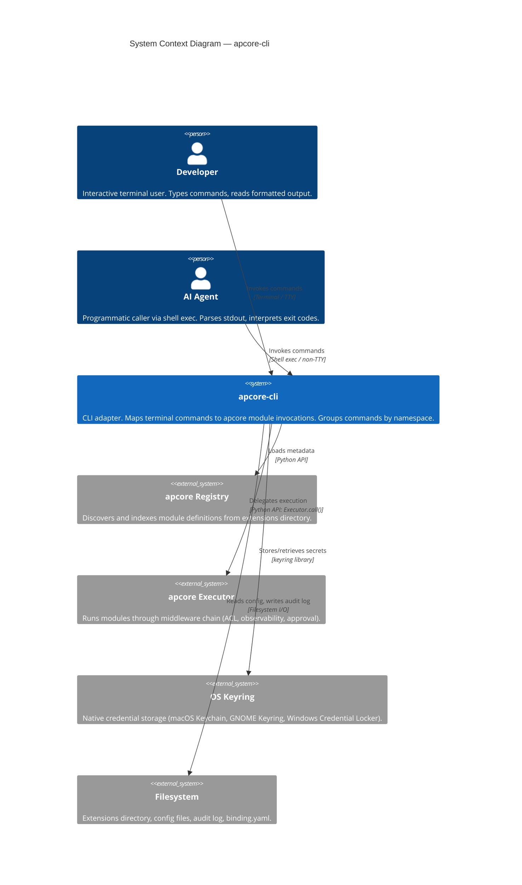
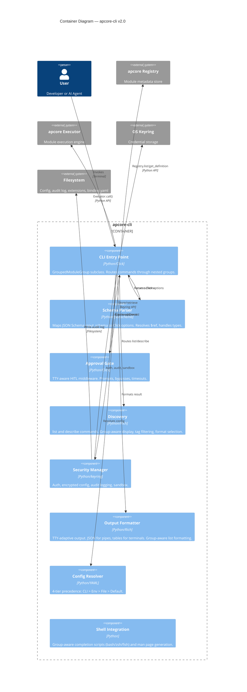
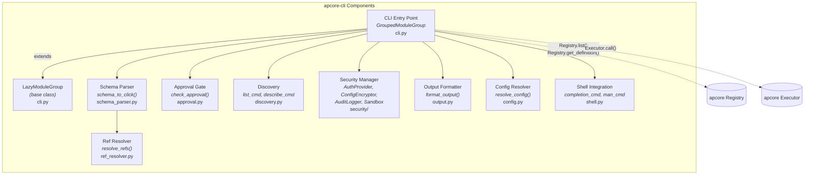
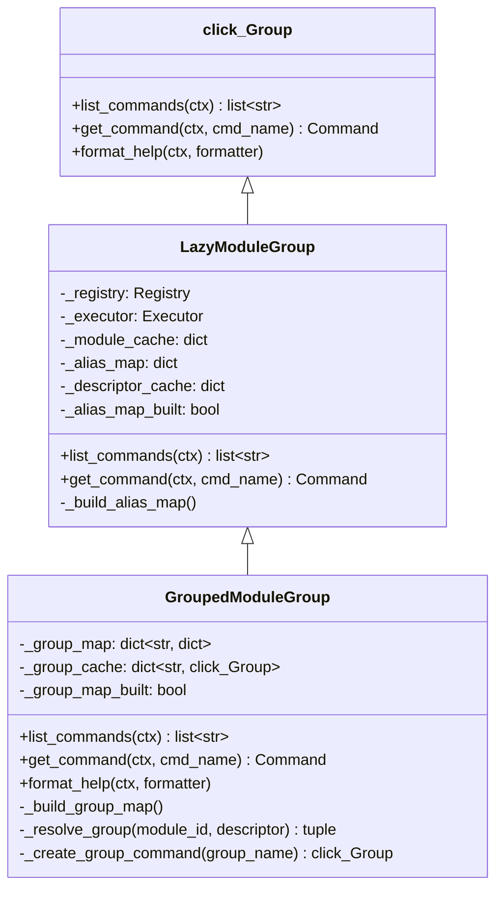
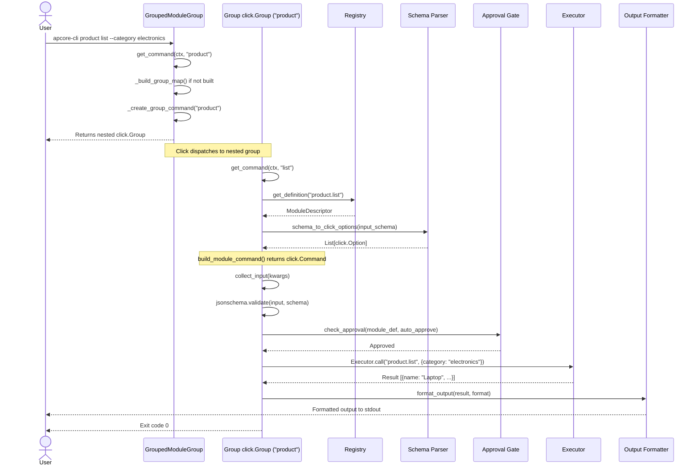
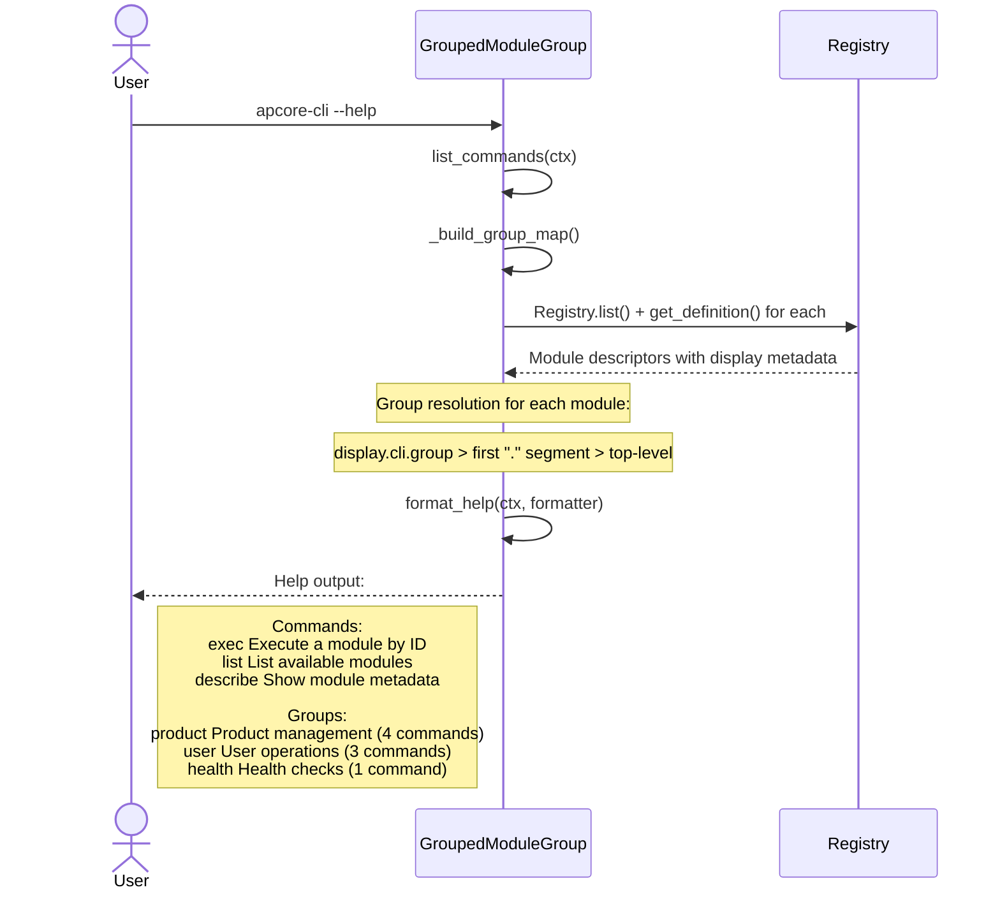
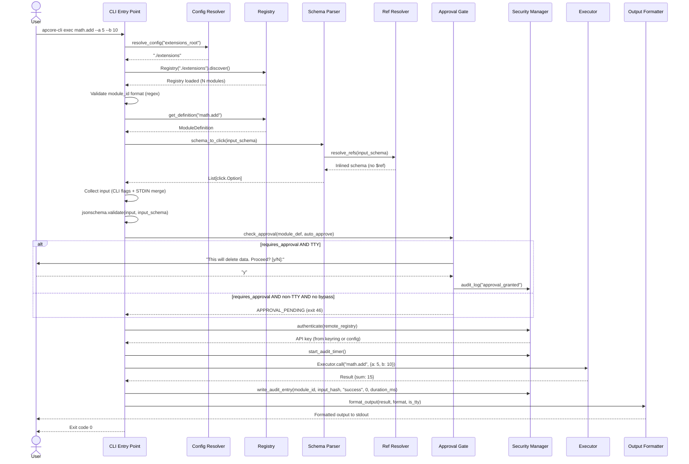
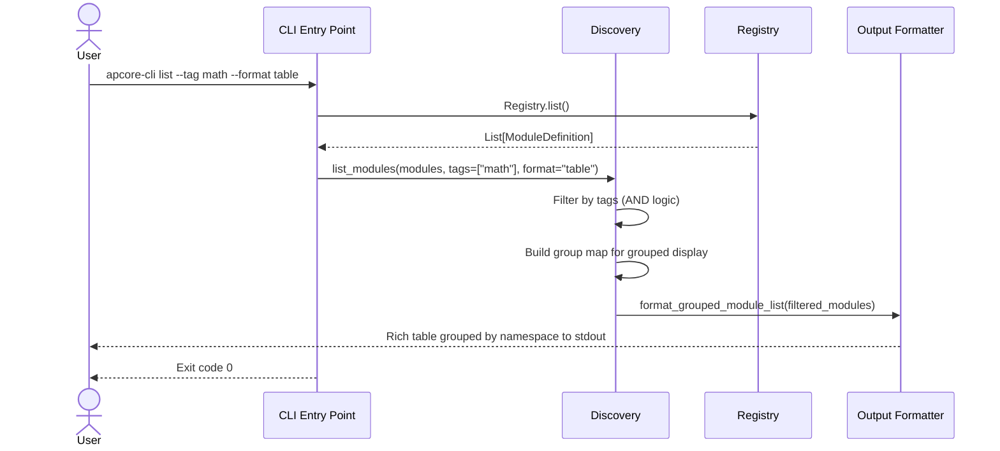
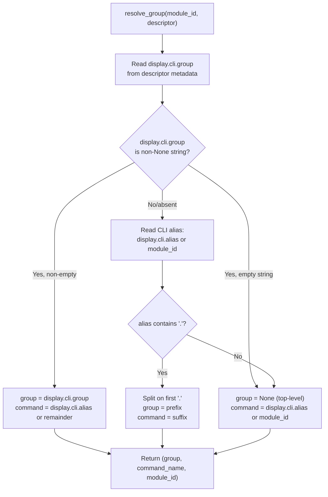
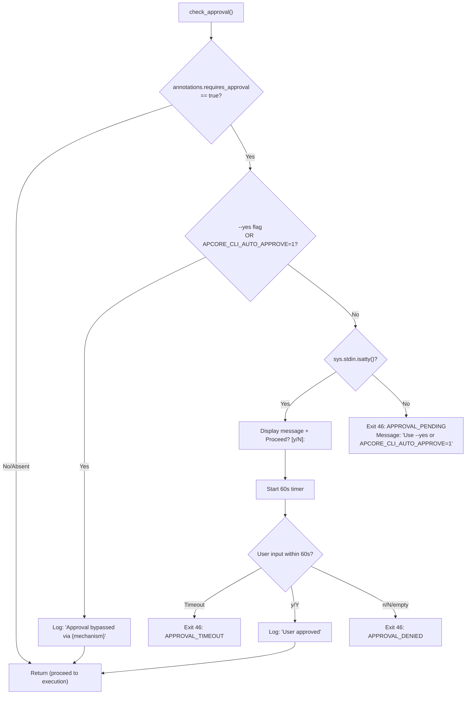

# Technical Design: apcore-cli

---

## 1. Document Information

| Field | Value |
|-------|-------|
| **Document Title** | Technical Design: apcore-cli |
| **Version** | 2.0 |
| **Author** | Spec Forge |
| **Date** | 2026-03-23 |
| **Status** | Draft |
| **Supersedes** | Tech Design v1.0 (`docs/tech-design.md`) |
| **Upstream SRS** | `docs/srs.md` (SRS-APCORE-CLI-001 v0.1) |

---

## 2. Revision History

| Version | Date | Author | Description |
|---------|------|--------|-------------|
| 1.0 | 2026-03-14 | Spec Forge | Full rewrite from SRS. Supersedes v0.4. Adds security stack, shell integration, C4 diagrams, traceability matrix. |
| 2.0 | 2026-03-23 | Spec Forge | Adds Display Overlay integration (ADR-07), Grouped CLI Commands (ADR-08). New `GroupedModuleGroup` class, group resolution algorithm, updated discovery/shell/output components. |

---

## 3. Overview

### 3.1 Background

The `apcore` ecosystem provides a protocol for building AI-Perceivable modules with a 3-layer metadata model (Discovery, Capabilities, Execution). Currently, developers and AI agents lack a standard, low-overhead terminal interface for invoking these modules. `apcore-cli` is a CLI adapter that bridges this gap, translating terminal commands into apcore module invocations.

**New in v2.0:** Web projects using `fastapi-apcore` or similar scanners often generate 50+ module IDs with dot-separated namespaces (e.g., `product.list`, `product.get`, `user.create`, `user.update`). The flat command list produced by v1.0 becomes unusable at this scale. This version introduces **grouped CLI commands** — nested `click.Group` subcommands organized by namespace prefix — along with **display overlay integration** for user-facing command naming.

### 3.2 Goals

1. **Auto-Mapping**: Zero-config generation of CLI commands from `apcore` Module JSON Schema definitions (SRS FR-SCHEMA-001 through FR-SCHEMA-006).
2. **Efficiency**: < 100ms CLI startup time, < 50ms adapter overhead excluding module execution (SRS NFR-PERF-001, NFR-PERF-002).
3. **Safety**: TTY-aware Human-in-the-Loop approval gates for destructive or sensitive operations (SRS FR-APPR-001 through FR-APPR-005).
4. **Composability**: Unix pipe integration via STDIN JSON input and TTY-adaptive output formatting (SRS FR-DISP-004, FR-DISC-004).
5. **Security**: Full authentication, encrypted config, audit logging, and sandboxed execution stack (SRS FR-SEC-001 through FR-SEC-004).
6. **Scalable Navigation**: Grouped command hierarchy for projects with 50+ modules, with readable root help and intuitive `apcore-cli <group> <command>` invocation. *(New in v2.0)*
7. **Display Overlay**: Surface-specific command naming and descriptions via `binding.yaml` display metadata, replacing direct module_id exposure. *(New in v2.0)*

### 3.3 Non-Goals

- Remote execution via `apcore-a2a` (deferred to Phase 4).
- Replacement for `apcore-mcp` (they are complementary adapters).
- GUI or TUI dashboard for module management.
- Cross-surface group configuration (grouping is CLI-only; MCP/A2A have their own presentation needs).

---

## 4. System Context (C4 Level 1)



### 4.1 Actors

| Actor | Type | Interaction Mode | Key Needs | SRS Reference |
|-------|------|------------------|-----------|---------------|
| Developer | Human | Interactive TTY | Descriptive help, readable errors, tab completion, approval prompts, grouped command navigation | SRS §4.3 |
| AI Agent | Programmatic | Non-TTY shell exec | Deterministic exit codes, structured JSON output, no interactive prompts, predictable group.command addressing | SRS §4.3 |
| CI/CD System | Automated | Non-TTY | Approval bypass via `--yes` or env var, deterministic behavior | SRS FR-APPR-004 |

---

## 5. Solution Design

### 5.1 Solution A: Auto-Group with Display Override (Recommended)

**Description:** Extend `LazyModuleGroup` with a `GroupedModuleGroup` subclass that automatically groups modules by the first `.` segment of their CLI alias (or module_id), creating nested `click.Group` instances for each namespace prefix. The `display.cli.group` field in `binding.yaml` overrides the auto-detected group. Modules without a `.` in their resolved name remain top-level commands.

**Architecture:**
- `GroupedModuleGroup` inherits from `LazyModuleGroup` and overrides `list_commands()` and `get_command()`.
- On `list_commands()`, it returns built-in commands plus group names (not individual module commands).
- On `get_command(group_name)`, it returns a dynamically created `click.Group` containing all commands in that group.
- Group resolution follows a 3-tier priority: `display.cli.group` (explicit) > first `.` segment of CLI alias > top-level (no group).
- Root `--help` shows group names with description and command count, keeping output readable at 50+ modules.
- Grouping is always-on with no toggle flag.
- Single-command groups remain as groups (e.g., `health.check` becomes group `health`, command `check`).

**Pros:**
- Zero-configuration: groups emerge naturally from existing dot-separated names.
- Scales to 100+ modules while keeping root help readable.
- `display.cli.group` override enables flexible reorganization without renaming modules.
- Forward-compatible: adding commands to a group later does not break existing invocations.
- Preserves all v1.0 module execution behavior (only the routing layer changes).

**Cons:**
- Adds one level of Click nesting, increasing `get_command()` call depth by 1.
- Modules previously invoked as `apcore-cli user.list` must now be invoked as `apcore-cli user list` (breaking change, acceptable at v0.3.0).
- Shell completion scripts need updating to handle nested groups.

**Technology choices:**
- `click >= 8.1` for CLI framework (existing).
- No new dependencies.

### 5.2 Solution B: Flat Aliases with Category Tags

**Description:** Keep all commands at the top level but add category tags to `--help` output. Use display overlay to assign short aliases (e.g., `user-list` instead of `user.list`). Help output groups commands by tag using Rich formatting.

**Architecture:**
- `LazyModuleGroup` remains the root group (no subclassing).
- `list_commands()` returns all module aliases as flat top-level commands.
- `format_help()` is overridden to group commands by a `display.cli.category` tag in `--help` output.
- Invocation: `apcore-cli user-list` (flat, hyphenated).

**Pros:**
- No nested Click groups; simpler Click command tree.
- No breaking change to invocation syntax (commands stay top-level).
- Easier shell completion (single level).

**Cons:**
- Root `--help` still lists every command — at 50+ modules, this produces 3+ screens of output even with visual grouping.
- Flat namespace collisions more likely (e.g., `user-list` vs `user_list`).
- Does not match developer mental model: web developers expect `apcore-cli user list` (noun-verb), not `apcore-cli user-list`.
- No natural way to scope flags or help to a group (cannot do `apcore-cli user --help`).
- Tab completion for `apcore-cli <TAB>` dumps all 50+ commands at once.

### 5.3 Solution C: Manual Group Registration

**Description:** Require binding.yaml to explicitly declare groups and their members. No auto-detection. Each group is a manually configured `click.Group` with explicit command membership.

**Architecture:**
- binding.yaml includes a `groups` section mapping group names to lists of module_ids.
- `create_cli()` reads groups config and creates explicit `click.Group` instances.
- Modules not listed in any group remain top-level.

**Pros:**
- Full control over grouping structure.
- No implicit behavior to debug.
- Groups can have custom help text and descriptions.

**Cons:**
- Violates the zero-config promise (SRS §3.2): every new module requires a binding.yaml update.
- Maintenance burden scales linearly with module count — 50 modules means 50 group assignments.
- Forgetting to add a module to a group makes it invisible.
- Breaks the "modules appear automatically" guarantee of `LazyModuleGroup`.
- Poor developer experience for rapid prototyping (add a FastAPI route, must also update binding.yaml).

### 5.4 Comparison Matrix

| Criteria | Weight | Solution A (Auto-Group) | Solution B (Flat + Tags) | Solution C (Manual Groups) |
|----------|--------|------------------------|-------------------------|---------------------------|
| **Scalable help** (50+ modules readable) | 25% | Root shows groups with counts. Score: 10 | Still lists all commands. Score: 4 | Groups shown at root. Score: 9 |
| **Zero-config** (SRS §3.2) | 20% | Fully automatic from `.` delimiter. Score: 10 | Automatic naming. Score: 8 | Requires explicit group config. Score: 2 |
| **Developer mental model** (noun-verb) | 15% | `apcore-cli user list` matches REST conventions. Score: 10 | `apcore-cli user-list` is flat. Score: 5 | `apcore-cli user list` matches. Score: 10 |
| **Shell completion UX** | 15% | Progressive: group then command. Score: 9 | 50+ completions at once. Score: 3 | Progressive: group then command. Score: 9 |
| **Override flexibility** | 10% | `display.cli.group` override. Score: 9 | Category tags. Score: 7 | Full control. Score: 10 |
| **Migration cost** (v0.3.0) | 10% | Syntax change, acceptable at 0.3.0. Score: 8 | No change. Score: 10 | Config file required. Score: 4 |
| **Implementation complexity** | 5% | One new class, method overrides. Score: 7 | Format override only. Score: 9 | Config parser + group builder. Score: 5 |
| **Weighted Total** | 100% | **9.3** | **5.3** | **6.5** |

### 5.5 Decision

**Solution A (Auto-Group with Display Override)** is selected. The scalable help display, zero-config grouping, and alignment with the noun-verb REST convention that web developers expect are decisive advantages. The breaking change to invocation syntax is acceptable at v0.3.0 with a tiny user base. The `display.cli.group` override provides an escape hatch for non-standard grouping needs.

This decision is recorded as ADR-08.

---

## 6. Architecture Decision Records

### ADR-01: CLI Framework — Click over Argparse/Typer

**Context:** The CLI adapter needs a framework that supports dynamic command generation, interactive prompts, boolean flag pairs, and shell completion.

**Decision:** Use `click >= 8.1` as the CLI framework.

**Rationale:** See §5.3 (v1.0) comparison matrix. Click's `click.Group` subclassing, `click.confirm()`, and `--flag/--no-flag` support directly satisfy SRS requirements FR-SCHEMA-002, FR-APPR-002, and FR-SHELL-001.

**Alternatives rejected:** `argparse` (too much custom code), `typer` (adds Pydantic dependency, less control over dynamic command generation).

### ADR-02: CLI Program Name — Default to Entry-Point, Not Hardcoded

**Context:** `apcore-cli` is both a standalone CLI tool and a reusable library. When downstream projects (e.g., `myproject`) add it as a dependency and publish their own entry-point script, help output and version output should display their project name, not the internal `apcore-cli` string.

**Decision:** The program name used in `--help` and `--version` output shall be resolved dynamically from `os.path.basename(sys.argv[0])` at startup rather than being hardcoded. An explicit `prog_name` parameter on `create_cli()` and `main()` provides override capability. The fallback when `argv[0]` is unavailable or empty is `apcore-cli`.

**Precedence (highest to lowest):**
1. Explicit `prog_name` parameter passed to `create_cli()` or `main()`.
2. `os.path.basename(sys.argv[0])` — the invoking entry-point script name.

**Rationale:** Downstream projects should be able to redistribute their CLI under a branded name with zero code changes. A project that installs its own entry-point `[project.scripts] myproject = "apcore_cli.__main__:main"` will automatically get `myproject --help` and `myproject, version X.Y.Z` without forking the source.

**Entry point (default, this package):**
```toml
[project.scripts]
apcore-cli = "apcore_cli.__main__:main"
```

**Downstream project entry point:**
```toml
# downstream_project/pyproject.toml
[project.scripts]
myproject = "apcore_cli.__main__:main"
# Result: `myproject --help` and `myproject, version X.Y.Z`
```

**Explicit override (programmatic):**
```python
from apcore_cli.__main__ import main
main(prog_name="myproject")
```

**Alternative rejected:** Hardcoding `"apcore-cli"` everywhere. This was the initial approach and was rejected because it breaks the library-use contract — downstream project users would see `apcore-cli` in their tool's help output even when the command they typed was `myproject`.

### ADR-03: Executor Integration — Direct Delegation

**Context:** The CLI must integrate with apcore's execution pipeline to preserve the middleware chain (ACL, observability, approval handling).

**Decision:** Use `Executor.call(module_id, validated_input)` for all module invocations. Support both standalone mode (create Executor from Registry) and programmatic mode (accept pre-configured Executor).

**Rationale:** Preserves the full apcore middleware chain. Consistent with `apcore-mcp` and `apcore-a2a`. The CLI is a synchronous one-shot process; `Executor.call()` (sync) is used rather than `call_async()`.

```python
# Standalone mode (CLI entry point)
registry = Registry("./extensions")
registry.discover()
executor = Executor(registry)
result = executor.call(module_id, validated_input)

# Programmatic mode (library use)
def create_cli(executor: Executor) -> click.Group:
    ...
```

### ADR-04: Encrypted Configuration — Keyring with AES-256-GCM Fallback

**Context:** Sensitive values (API keys, tokens) must not be stored in plaintext in config files (SRS FR-SEC-002, NFR-SEC-001).

**Decision:** Use the `keyring` library (>= 24.0) for OS-native credential storage as the primary mechanism. When the keyring is unavailable (headless servers, containers), fall back to AES-256-GCM encryption with a machine-derived key.

**Rationale:**
- `keyring` provides cross-platform support: macOS Keychain, GNOME Keyring / Secret Service, Windows Credential Locker.
- The AES-256-GCM fallback ensures functionality in headless environments where no keyring daemon is available.
- Machine-derived key uses `hostname + username + salt` to prevent portable decryption of stolen config files.

**Alternatives considered:**
- **SOPS (Mozilla):** Heavyweight, requires GPG or cloud KMS setup. Overkill for a CLI tool's local config.
- **python-dotenv with .env files:** No encryption; just obfuscation. Violates NFR-SEC-001.
- **Fernet (cryptography library):** Simpler API but AES-CBC mode; AES-256-GCM provides authenticated encryption with better security properties.

### ADR-05: Audit Logging — JSON Lines Format

**Context:** Every module execution must be logged for accountability and forensics (SRS FR-SEC-003).

**Decision:** Use append-only JSON Lines (`.jsonl`) format at `~/.apcore-cli/audit.jsonl`.

**Rationale:** JSON Lines is grep-friendly, append-only (no file corruption from concurrent writes), and parseable by standard tools (`jq`, `grep`, log aggregation systems). Each line is an independent JSON object, so partial writes don't corrupt the file.

### ADR-06: Execution Sandboxing — Subprocess with Restricted Environment

**Context:** Untrusted modules should be isolated from the host system (SRS FR-SEC-004).

**Decision:** Use `subprocess.Popen` with a restricted environment dictionary and a temporary working directory when `--sandbox` is active. The restricted environment includes only `PATH`, `PYTHONPATH`, `HOME` (set to temp dir), and explicitly allowed `APCORE_*` variables.

**Rationale:** Process-level isolation is portable across Linux, macOS, and Windows. It does not require elevated privileges or platform-specific APIs (unlike cgroups, AppArmor, or Windows AppContainer). For Phase 1, this provides defense-in-depth without operational complexity.

**Limitations:** This is not a security boundary against a determined adversary. The subprocess can still make network calls. Full containerization (Docker, Bubblewrap) is deferred to Phase 2.

### ADR-07: Display Overlay — Surface-Specific Naming via binding.yaml

**Context:** Scanner-generated module_ids (e.g., `product.get_product_product__product_id_.get`) are verbose and framework-specific. Different CLI/MCP/A2A surfaces need different presentation formats. The previous `simplify_ids` approach modified module_ids directly, violating layer boundaries.

**Decision:** Use the PROTOCOL_SPEC §5.13 Display Overlay system. `binding.yaml` contains a sparse `display` section where each binding can override surface-facing names and descriptions. The resolve chain is: `display.cli.alias` > `display.default.alias` > `suggested_alias` > `module_id`. `LazyModuleGroup` reads the overlay at alias-map build time and uses it for command naming, descriptions, and help text.

**Implementation in v1.1 (current):**
- `_build_alias_map()` reads `metadata["display"]["cli"]["alias"]` for each module.
- `_alias_map` stores `cli_alias -> module_id` for reverse lookup.
- `_descriptor_cache` stores `module_id -> descriptor` to avoid re-fetching.
- `build_module_command()` uses `display.cli.alias` for command name and `display.cli.description` for help text.

**Rationale:** Separates concerns — scanners produce canonical IDs, surfaces consume overlay-resolved names. One binding.yaml serves all surfaces. `simplify_ids` is deprecated.

### ADR-08: Grouped CLI Commands — Auto-Group by Dot Delimiter

**Context:** Web projects using `fastapi-apcore` generate 50+ modules with dot-separated namespaces (e.g., `product.list`, `product.get`, `user.create`). The flat command list produced by `LazyModuleGroup` is unusable at this scale — root `--help` produces multiple screens of output, and tab completion dumps all commands at once.

**Decision:** Introduce `GroupedModuleGroup(LazyModuleGroup)` that creates nested `click.Group` instances for each namespace prefix. Group resolution follows: `display.cli.group` (explicit) > first `.` segment of CLI alias > top-level. Grouping is always-on. Single-command groups stay as groups. Root help shows collapsed group display with command counts.

**Rationale:** See §5.4 comparison matrix. Auto-grouping by `.` delimiter matches the existing module_id namespace convention, requires zero configuration, and produces the `noun verb` pattern that web developers expect (`apcore-cli user list`). The `display.cli.group` override enables non-standard grouping without renaming modules.

**Breaking change:** Modules previously invoked as `apcore-cli user.list` must now be invoked as `apcore-cli user list` (space instead of dot). This is acceptable at v0.3.0 with a tiny user base and no backward compatibility commitment.

**Key design decisions:**
1. **Grouping always on** — no `group_commands=True` toggle. If flat mode is needed per-module, `display.cli.group: ""` opts out.
2. **Single-command groups stay as groups** — `health.check` becomes `health check`, not promoted to top-level `health-check`. This is consistent (has `.` = has group) and forward-compatible (adding `health status` later does not break existing commands).
3. **`display.cli.group` is CLI-only** — not added to PROTOCOL_SPEC §5.13. It is a CLI surface convention documented in this tech design and the feature spec only.

---

## 7. Architecture Design

### 7.1 Container Diagram (C4 Level 2)



### 7.2 Component Diagram (C4 Level 3)



### 7.3 Class Hierarchy Diagram



### 7.4 Sequence Diagram: Grouped Command Invocation



### 7.5 Sequence Diagram: Root Help with Groups



### 7.6 Sequence Diagram: `apcore-cli exec` Full Lifecycle



### 7.7 Sequence Diagram: Discovery — `apcore-cli list`



### 7.8 Group Resolution Algorithm



---

## 8. Detailed Design

### 8.1 Component Overview

| Component | Module Path | SRS Requirements | Priority | Feature Spec |
|-----------|-------------|------------------|----------|--------------|
| **Core Dispatcher** | `apcore_cli/cli.py` | FR-DISP-001 through FR-DISP-006 | P0 | `docs/features/core-dispatcher.md` |
| **Grouped Commands** | `apcore_cli/cli.py` | FR-DISP-001, FR-DISP-002 | P0 | `docs/features/grouped-commands.md` |
| **Schema Parser** | `apcore_cli/schema_parser.py` | FR-SCHEMA-001 through FR-SCHEMA-006 | P0 | `docs/features/schema-parser.md` |
| **Approval Gate** | `apcore_cli/approval.py` | FR-APPR-001 through FR-APPR-005 | P1 | `docs/features/approval-gate.md` |
| **Discovery** | `apcore_cli/discovery.py` | FR-DISC-001 through FR-DISC-004 | P1 | `docs/features/discovery.md` |
| **Security Manager** | `apcore_cli/security/` | FR-SEC-001 through FR-SEC-004 | P1/P2 | `docs/features/security.md` |
| **Shell Integration** | `apcore_cli/shell.py` | FR-SHELL-001, FR-SHELL-002 | P2 | `docs/features/shell-integration.md` |
| **Config Resolver** | `apcore_cli/config.py` | FR-DISP-005 | P0 | `docs/features/config-resolver.md` |
| **Output Formatter** | `apcore_cli/output.py` | FR-DISC-004 | P1 | `docs/features/output-formatter.md` |

### 8.2 Core Dispatcher

#### 8.2.1 Class: `LazyModuleGroup`

**Purpose:** Custom `click.Group` subclass that lazily discovers and loads modules from the apcore Registry. Serves as the base class for `GroupedModuleGroup`.

```python
class LazyModuleGroup(click.Group):
    """Custom Click Group that lazily loads apcore modules as subcommands."""

    def __init__(
        self,
        registry: Registry,
        executor: Executor,
        help_text_max_length: int = 1000,
        **kwargs: Any,
    ) -> None:
        super().__init__(**kwargs)
        self._registry = registry
        self._executor = executor
        self._help_text_max_length = help_text_max_length
        self._module_cache: dict[str, click.Command] = {}
        self._alias_map: dict[str, str] = {}           # CLI alias -> module_id
        self._descriptor_cache: dict[str, Any] = {}     # module_id -> descriptor
        self._alias_map_built: bool = False
```

**Method: `_build_alias_map()`**

Logic steps:
- If `_alias_map_built` is True, return immediately (idempotent).
- Iterates `self._registry.list()` to get all module IDs.
- For each module ID: calls `self._registry.get_definition(module_id)` to get the descriptor.
- Reads `descriptor.metadata["display"]["cli"]["alias"]` if present; else uses `module_id`.
- Stores `alias -> module_id` in `self._alias_map` (only if alias differs from module_id).
- Stores `module_id -> descriptor` in `self._descriptor_cache`.
- Sets `self._alias_map_built = True` only inside the try block (on success).
- On failure: logs WARNING "Failed to build alias map from registry", does not set the flag (allows retry).

**Method: `list_commands(ctx) -> list[str]`**

Logic steps:
1. Define built-in commands: `["exec", "list", "describe", "completion", "man"]`.
2. Call `_build_alias_map()`.
3. Build reverse map: `module_id -> alias` from `_alias_map`.
4. Get all module IDs from `registry.list()`.
5. For each module_id: use the alias if one exists, else use the module_id.
6. Return `sorted(set(builtin + names))`.

Edge cases:
- Registry returns empty list: return only built-in commands.
- Registry raises exception: catch, log WARNING, return only built-in commands.

**Method: `get_command(ctx, cmd_name) -> click.Command | None`**

Logic steps:
1. Check `self.commands` dict for built-in commands. If found, return it.
2. Check `self._module_cache` for cached command. If found, return it.
3. Call `_build_alias_map()` if not built.
4. Resolve `module_id = self._alias_map.get(cmd_name, cmd_name)`.
5. Check `self._descriptor_cache.get(module_id)`. If found, use cached descriptor.
6. Else call `self._registry.get_definition(module_id)`.
7. If descriptor is None, return None.
8. Call `build_module_command(module_def, self._executor, cmd_name=cmd_name)`.
9. Store in `self._module_cache[cmd_name]`.
10. Return the command.

**Traces to:** FR-DISP-001, FR-DISP-002.

#### 8.2.2 Class: `GroupedModuleGroup`

**Purpose:** Extends `LazyModuleGroup` to create nested `click.Group` instances for each namespace prefix, producing a two-level command hierarchy.

```python
class GroupedModuleGroup(LazyModuleGroup):
    """Click Group that organizes modules into nested subcommand groups.

    Group resolution priority:
    1. display.cli.group (explicit override from binding.yaml)
    2. First '.' segment of CLI alias (auto-detected)
    3. Top-level (no group — module has no '.' in name)

    Single-command groups remain as groups (not promoted to top-level).
    """

    def __init__(self, **kwargs: Any) -> None:
        super().__init__(**kwargs)
        # group_name -> {cmd_name: (module_id, descriptor)}
        self._group_map: dict[str, dict[str, tuple[str, Any]]] = {}
        # Top-level modules (no group)
        self._top_level_modules: dict[str, tuple[str, Any]] = {}
        # Cached click.Group instances for each group
        self._group_cache: dict[str, click.Group] = {}
        self._group_map_built: bool = False
```

**Method: `_resolve_group(module_id: str, descriptor: Any) -> tuple[str | None, str]`**

Returns `(group_name_or_None, command_name)`.

Logic steps:
1. Read `display = _get_display(descriptor)`.
2. Read `cli_display = display.get("cli") or {}`.
3. Check `explicit_group = cli_display.get("group")`:
   a. If `explicit_group` is a string and non-empty: return `(explicit_group, cli_display.get("alias") or module_id)`.
   b. If `explicit_group` is an empty string `""`: return `(None, cli_display.get("alias") or module_id)` — explicitly opted out of grouping.
4. Determine CLI name: `cli_name = cli_display.get("alias") or module_id`.
5. If `"."` in `cli_name`:
   a. `parts = cli_name.split(".", 1)`.
   b. Return `(parts[0], parts[1])`.
6. Else: return `(None, cli_name)`.

Parameter validation:
- `module_id`: must be non-empty string. If empty, log WARNING and return `(None, module_id)`.
- `descriptor`: must be non-None. Caller ensures this.
- `explicit_group`: accepts `str | None`. Only non-empty strings trigger explicit group. Empty string means opt-out.

**Method: `_build_group_map()`**

Logic steps:
1. If `_group_map_built` is True, return immediately.
2. Call `self._build_alias_map()` (ensures alias map and descriptor cache are populated).
3. Clear `_group_map` and `_top_level_modules`.
4. For each `module_id` in `self._registry.list()`:
   a. Get `descriptor = self._descriptor_cache.get(module_id)`. Skip if None.
   b. Call `(group_name, cmd_name) = self._resolve_group(module_id, descriptor)`.
   c. If `group_name is None`: store in `self._top_level_modules[cmd_name] = (module_id, descriptor)`.
   d. Else: store in `self._group_map[group_name][cmd_name] = (module_id, descriptor)`.
5. Set `self._group_map_built = True`.
6. On exception: log WARNING "Failed to build group map", do not set flag.

**Method: `list_commands(ctx) -> list[str]`**

Logic steps:
1. Define built-in commands: `["exec", "list", "describe", "completion", "man"]`.
2. Call `_build_group_map()`.
3. Collect group names from `self._group_map.keys()`.
4. Collect top-level module names from `self._top_level_modules.keys()`.
5. Return `sorted(set(builtin + list(group_names) + list(top_level_names)))`.

Edge cases:
- A group name collides with a built-in command name (e.g., module `list.something`): the built-in command takes priority. Log WARNING: `"Group name 'list' conflicts with built-in command. Modules in this group will be inaccessible via grouped commands. Use 'exec' to invoke them."`.
- A top-level module name collides with a group name: the group takes priority. The module is accessible via `exec <module_id>`.

**Method: `get_command(ctx, cmd_name) -> click.Command | None`**

Logic steps:
1. Check `self.commands` dict for built-in commands. If found, return it.
2. Call `_build_group_map()`.
3. Check `self._group_cache.get(cmd_name)`. If found, return cached group.
4. If `cmd_name in self._group_map`: call `_create_group_command(cmd_name)`, cache it, return it.
5. If `cmd_name in self._top_level_modules`:
   a. Check `self._module_cache.get(cmd_name)`. If found, return it.
   b. Get `(module_id, descriptor) = self._top_level_modules[cmd_name]`.
   c. Call `build_module_command(descriptor, self._executor, cmd_name=cmd_name)`.
   d. Cache in `self._module_cache[cmd_name]`. Return it.
6. Return None.

**Method: `_create_group_command(group_name: str) -> click.Group`**

Logic steps:
1. Get `members = self._group_map[group_name]` (dict of `cmd_name -> (module_id, descriptor)`).
2. Compute `group_help = f"{group_name.capitalize()} commands ({len(members)} command{'s' if len(members) != 1 else ''})"`.
3. Override `group_help` if any member has `display.cli.group_description` (use first non-None value found).
4. Create a new `click.Group`:

```python
@click.group(name=group_name, help=group_help)
def group_cmd():
    pass
```

5. For each `(cmd_name, (module_id, descriptor))` in `members.items()`:
   a. Create a lazy command loader: on first access, call `build_module_command(descriptor, self._executor, cmd_name=cmd_name)`.
   b. Register the command on `group_cmd`.
6. Return `group_cmd`.

Implementation detail — the nested group uses a lightweight `LazyGroup` inner class to defer `build_module_command()` until the specific subcommand is invoked:

```python
class _LazyGroup(click.Group):
    """Nested group that lazily builds commands from module descriptors."""

    def __init__(
        self,
        members: dict[str, tuple[str, Any]],
        executor: Executor,
        help_text_max_length: int,
        **kwargs: Any,
    ) -> None:
        super().__init__(**kwargs)
        self._members = members
        self._executor = executor
        self._help_text_max_length = help_text_max_length
        self._cmd_cache: dict[str, click.Command] = {}

    def list_commands(self, ctx: click.Context) -> list[str]:
        return sorted(self._members.keys())

    def get_command(self, ctx: click.Context, cmd_name: str) -> click.Command | None:
        if cmd_name in self._cmd_cache:
            return self._cmd_cache[cmd_name]
        entry = self._members.get(cmd_name)
        if entry is None:
            return None
        module_id, descriptor = entry
        cmd = build_module_command(
            descriptor,
            self._executor,
            help_text_max_length=self._help_text_max_length,
            cmd_name=cmd_name,
        )
        self._cmd_cache[cmd_name] = cmd
        return cmd
```

**Method: `format_help(ctx, formatter)`**

Override Click's default help formatter to show groups in a collapsed format at root level:

Logic steps:
1. Call `_build_group_map()`.
2. Write usage line via `self.format_usage(ctx, formatter)`.
3. Write help text (root group description).
4. Write "Commands:" section with built-in commands (exec, list, describe, completion, man).
5. Write "Top-level Modules:" section with ungrouped modules (if any).
6. Write "Groups:" section:
   - For each group in sorted `self._group_map.keys()`:
     - Compute count: `len(self._group_map[group_name])`.
     - Compute short description: first member's `display.cli.group_description`, or `f"{group_name.capitalize()} commands"`.
     - Format line: `  {group_name:20s}  {short_description} ({count} commands)`.
7. Write epilog if present.

Example root `--help` output:
```
Usage: myproject [OPTIONS] COMMAND [ARGS]...

  CLI adapter for the apcore module ecosystem.

Options:
  --version             Show the version and exit.
  --extensions-dir PATH Path to apcore extensions directory.
  --log-level [DEBUG|INFO|WARNING|ERROR]
                        Log verbosity.
  --help                Show this message and exit.

Commands:
  exec        Execute a module by canonical ID
  list        List available modules
  describe    Show module metadata and schema
  completion  Generate shell completion script
  man         Generate man page

Groups:
  product     Product management (4 commands)
  user        User operations (3 commands)
  health      Health checks (1 command)
```

Example `apcore-cli product --help` output:
```
Usage: myproject product [OPTIONS] COMMAND [ARGS]...

  Product management (4 commands)

Commands:
  list        List all products
  get         Get product by ID
  create      Create a new product
  delete      Delete a product
```

**Traces to:** FR-DISP-001, FR-DISP-002, ADR-08.

#### 8.2.3 Function: `build_module_command`

**Signature:** `build_module_command(module_def: ModuleDescriptor, executor: Executor, help_text_max_length: int = 1000, cmd_name: str | None = None) -> click.Command`

Logic steps:
1. Resolve display overlay fields (§5.13):
   - Read `display = _get_display(module_def)`.
   - Read `cli_display = display.get("cli") or {}`.
2. Get `input_schema` from `module_def.input_schema`. Handle Pydantic v1/v2 model classes by converting to dict.
3. Get `module_id = _get_module_id(module_def)` (canonical_id or module_id).
4. Determine `effective_cmd_name = cmd_name or cli_display.get("alias") or module_id`.
5. Determine `cmd_help = cli_display.get("description") or module_def.description`.
6. If `input_schema` has properties: call `resolve_refs(input_schema, max_depth=32, module_id=module_id)`. On non-SystemExit exception: log WARNING, use raw schema.
7. Call `schema_to_click_options(resolved_schema, max_help_length=help_text_max_length)`.
8. Create callback function that:
   a. Separates built-in options (input, yes, large_input, format, sandbox) from schema kwargs.
   b. Calls `collect_input(stdin_input, kwargs, large_input)`.
   c. Calls `reconvert_enum_values(merged, schema_options)`.
   d. If schema has properties: calls `jsonschema.validate(merged, resolved_schema)`. On failure: exit 45.
   e. Calls `check_approval(module_def, auto_approve)`.
   f. Records `audit_start = time.monotonic()`.
   g. Creates `Sandbox(enabled=sandbox_flag)`, calls `sandbox.execute(module_id, merged, executor)`.
   h. Computes `duration_ms`.
   i. Audit logs (success).
   j. Formats and prints result.
   k. On `KeyboardInterrupt`: exit 130.
   l. On other exception: map error code, audit log (error), exit with mapped code.
9. Create `click.Command` with `name=effective_cmd_name`, `help=cmd_help`, `callback=callback`.
10. Append built-in options: `--input`, `--yes`, `--large-input`, `--format`, `--sandbox`. These options are hidden from `--help` output by default; when `--verbose` is passed globally, they become visible.
11. Guard: check schema property names do not collide with reserved names `{input, yes, large_input, format, sandbox, verbose}`. On collision: exit 2.
12. Append schema-generated options.
13. Return the command.

**Traces to:** FR-DISP-002, FR-DISP-004, FR-SCHEMA-001.

#### 8.2.4 STDIN Input Collection

**Function:** `collect_input(stdin_flag: str | None, cli_kwargs: dict, large_input: bool) -> dict`

| Parameter | Type | Validation | Boundary Values | SRS Reference |
|-----------|------|------------|----------------|---------------|
| `stdin_flag` | `str \| None` | If `"-"`, read STDIN. If `None`, skip STDIN. | Empty string treated as None. | FR-DISP-004 |
| `cli_kwargs` | `dict` | Keys must be valid Python identifiers. Values from Click type coercion. | Empty dict is valid. | FR-DISP-002 |
| `large_input` | `bool` | Boolean flag. | `True` disables 10MB limit. | FR-DISP-004 AF-6 |

**STDIN buffer limits:**
- Default max: 10 MB (10,485,760 bytes). Reject with exit code 2 if exceeded without `--large-input`.
- With `--large-input`: No limit (read until EOF).
- Empty STDIN (0 bytes) when `--input -` is specified: treat as `{}`.

**Merge precedence:** CLI flags override STDIN values for duplicate keys (SRS FR-DISP-004 Main Flow step 4).

**Edge cases:**
- STDIN is a JSON array: exit code 2, message "STDIN JSON must be an object, got list."
- STDIN is a JSON primitive (string, number, boolean, null): exit code 2, message "STDIN JSON must be an object, got {type}."
- STDIN is invalid JSON: exit code 2, message includes parse error detail.
- STDIN without `--input -`: ignored entirely.

#### 8.2.5 Module ID Validation

**Regex:** `^[a-z][a-z0-9_]*(\.[a-z][a-z0-9_]*)*$`

| Input | Valid? | Exit Code |
|-------|--------|-----------|
| `math.add` | Yes | — |
| `text.summarize` | Yes | — |
| `a` | Yes | — |
| `a.b.c.d` | Yes | — |
| `MATH.ADD` | No | 2 |
| `math-add` | No | 2 |
| `.math` | No | 2 |
| `math.` | No | 2 |
| `123.add` | No | 2 |
| `a` * 129 | No (> 128 chars) | 2 |
| Empty string | No | 2 |

**Traces to:** FR-DISP-002 AF-2.

#### 8.2.6 Group Resolution Examples

| module_id | display.cli.alias | display.cli.group | Resolved Group | Resolved Command | Invocation |
|-----------|-------------------|-------------------|---------------|-----------------|------------|
| `product.list_products.get` | `product.list` | _(absent)_ | `product` | `list` | `apcore-cli product list` |
| `product.get_product_product__product_id_.get` | `product.get` | _(absent)_ | `product` | `get` | `apcore-cli product get` |
| `health.check` | _(absent)_ | _(absent)_ | `health` | `check` | `apcore-cli health check` |
| `math.add` | _(absent)_ | _(absent)_ | `math` | `add` | `apcore-cli math add` |
| `standalone_tool` | _(absent)_ | _(absent)_ | _(None)_ | `standalone_tool` | `apcore-cli standalone_tool` |
| `some.deep.nested.module` | `analytics.report` | _(absent)_ | `analytics` | `report` | `apcore-cli analytics report` |
| `some.deep.nested.module` | `report` | `analytics` | `analytics` | `report` | `apcore-cli analytics report` |
| `some.module` | `flat_cmd` | `""` | _(None)_ | `flat_cmd` | `apcore-cli flat_cmd` |

#### 8.2.7 Function: `create_cli`

**Signature:** `create_cli(extensions_dir: str | None = None, prog_name: str | None = None) -> click.Group`

**File:** `apcore_cli/__main__.py`

**Purpose:** Factory function that assembles and returns the fully configured Click group. In v2.0, uses `GroupedModuleGroup` instead of `LazyModuleGroup`.

Logic steps:
1. Resolve `prog_name` (FR-DISP-006):
   a. If `prog_name` is not `None`, use it (Tier 1 — explicit parameter).
   b. Otherwise, compute `os.path.basename(sys.argv[0])`.
   c. If the result is empty, fall back to `"apcore-cli"`.
2. Resolve and apply initial log level (3-tier precedence, before Click runs):
   - Tier 1 (highest): `--log-level` CLI flag — applied at runtime in the group callback.
   - Tier 2: `APCORE_CLI_LOGGING_LEVEL` env var — CLI-specific.
   - Tier 3: `APCORE_LOGGING_LEVEL` env var — global fallback.
   - Default: `logging.WARNING`.
3. Resolve `extensions_dir` via ConfigResolver.
4. Verify path exists and is readable. Exit 47 on failure.
5. Instantiate `Registry(extensions_dir)`.
6. Call `registry.discover()`. Log DEBUG/INFO.
7. Instantiate `Executor(registry)`.
8. Initialize `AuditLogger()`.
9. **Build `click.Group` using `cls=GroupedModuleGroup`** (changed from `LazyModuleGroup` in v2.0).
10. Add `click.version_option`, `--extensions-dir`, `--log-level` options.
11. Register built-in commands via `register_discovery_commands()` and `register_shell_commands()`.
12. Return the assembled group.

**Traces to:** FR-DISP-001, FR-DISP-003, FR-DISP-005, FR-DISP-006.

### 8.3 Schema Parser

#### 8.3.1 Function: `schema_to_click_options`

**Signature:** `schema_to_click_options(schema: dict) -> list[click.Option]`

**Purpose:** Convert a resolved (no `$ref`) JSON Schema `properties` dict into a list of Click options.

**Type mapping table:**

| JSON Schema `type` | Click Type | Notes | SRS Reference |
|--------------------|-----------|-------|---------------|
| `"string"` | `click.STRING` | Default for unknown types. | FR-SCHEMA-001 |
| `"integer"` | `click.INT` | Strict integer parsing. | FR-SCHEMA-001 |
| `"number"` | `click.FLOAT` | Accepts both int and float. | FR-SCHEMA-001 |
| `"boolean"` | `is_flag=True` | `--flag/--no-flag` pair. | FR-SCHEMA-002 |
| `"object"` | `click.STRING` | Expects JSON string; parsed at validation. | FR-SCHEMA-001 |
| `"array"` | `click.STRING` | Expects JSON string; parsed at validation. | FR-SCHEMA-001 |
| Unknown / missing | `click.STRING` | Log WARNING. | FR-SCHEMA-001 AF-1, AF-2 |

**Property name to flag name conversion:**
- Replace underscores with hyphens: `input_file` -> `--input-file`
- Prefix with `--`: `name` -> `--name`

**Collision detection:** If two properties map to the same flag name after underscore-to-hyphen conversion (e.g., `input_file` and `input-file` both map to `--input-file`), exit with code 48 and a diagnostic message identifying both property names.

**Traces to:** FR-SCHEMA-001, FR-SCHEMA-002, FR-SCHEMA-003, FR-SCHEMA-004, FR-SCHEMA-005.

#### 8.3.2 Enum Handling

When a property has an `enum` field:
1. Convert all enum values to strings: `[str(v) for v in enum_values]`.
2. Create `click.Option` with `type=click.Choice(string_values)`.
3. After Click parses the value, reconvert to the original type if the enum contained non-string types (e.g., integers).

| Scenario | Behavior | SRS Reference |
|----------|----------|---------------|
| `enum: ["json", "csv"]` | `click.Choice(["json", "csv"])` | FR-SCHEMA-003 |
| `enum: [1, 2, 3]` | `click.Choice(["1", "2", "3"])`, reconvert to int | FR-SCHEMA-003 AF-2 |
| `enum: []` | Treat as regular string, log WARNING | FR-SCHEMA-003 AF-1 |
| `enum: [true]` on boolean type | Standard boolean flag, ignore enum | FR-SCHEMA-002 AF-1 |

#### 8.3.3 Required Property Enforcement

1. Read `required` array from `input_schema`.
2. For each property name in `required`, set `required=True` on the corresponding `click.Option`.
3. If a required property name is not in `properties`, log WARNING and skip.
4. Required properties satisfied by STDIN merge are validated post-merge, not at Click parsing time. This means required flags are set to `required=False` when `--input -` is used, and validation is deferred to `jsonschema.validate()`.

**Traces to:** FR-SCHEMA-004.

#### 8.3.4 Help Text Generation

| Priority | Source Field | Behavior | SRS Reference |
|----------|-------------|----------|---------------|
| 1 (highest) | `x-llm-description` | Use if present and non-empty string. | FR-SCHEMA-005 |
| 2 | `description` | Use if `x-llm-description` is absent/empty. | FR-SCHEMA-005 |
| 3 (default) | None | `help=None` (Click shows no help text). | FR-SCHEMA-005 |

**Truncation:** Help text is passed to the CLI framework as-is for natural line wrapping. A configurable safety ceiling applies (default: 1000 characters via `cli.help_text_max_length`): text beyond this limit is truncated to `(limit - 3)` characters + `"..."`. Full description available via `apcore-cli describe <module_id>`.

**Traces to:** FR-SCHEMA-005.

#### 8.3.5 Reference Resolution

**Function:** `resolve_refs(schema: dict, max_depth: int = 32) -> dict`

**Algorithm:**
1. Walk the schema tree depth-first.
2. Maintain a `visited: set[str]` of resolved `$ref` targets and a `depth: int` counter.
3. For each `$ref` encountered:
   a. Increment depth. If depth > 32, exit code 48: "depth exceeded maximum of 32."
   b. Check if target is in `visited`. If so, exit code 48: "Circular $ref detected."
   c. Resolve the reference from `$defs`. If target not found, exit code 45: "Unresolvable $ref."
   d. Add target to `visited`. Inline the resolved schema.
4. For `allOf`: merge all sub-schemas' `properties` and `required` arrays (union).
5. For `anyOf`/`oneOf`: merge all sub-schema properties (union); only mark properties as required if they appear in ALL sub-schemas' `required` arrays (intersection).
6. Return fully inlined schema with no `$ref`, `$defs`, `allOf`, `anyOf`, `oneOf` remaining.

| Input | Expected Behavior | Exit Code | SRS Reference |
|-------|-------------------|-----------|---------------|
| `$ref: "#/$defs/Addr"` with valid `$defs.Addr` | Inline Addr properties | — | FR-SCHEMA-006 |
| Circular: A -> B -> A | Error: "Circular $ref detected" | 48 | FR-SCHEMA-006 AF-1 |
| Depth = 33 | Error: "depth exceeded maximum of 32" | 48 | FR-SCHEMA-006 AF-2 |
| `$ref: "#/$defs/Missing"` | Error: "Unresolvable $ref" | 45 | FR-SCHEMA-006 AF-3 |
| `allOf: [{props: {a}}, {props: {b}}]` | Merged: `{props: {a, b}}` | — | FR-SCHEMA-006 |
| `anyOf: [{req: [a]}, {req: [b]}]` | Required: `[]` (intersection is empty) | — | FR-SCHEMA-006 |

**Traces to:** FR-SCHEMA-006.

### 8.4 Approval Gate

#### 8.4.1 Function: `check_approval`

**Signature:** `check_approval(module_def: ModuleDefinition, auto_approve: bool) -> None`

**Flow:**



**Parameter validation:**

| Parameter | Type | Validation | Edge Cases |
|-----------|------|------------|------------|
| `module_def.annotations` | `dict \| None` | If None, skip approval gate entirely. | Module with no annotations field. |
| `module_def.annotations.requires_approval` | `bool \| None` | Must be exactly `True` (boolean). Any other type or value: skip. | `"true"` string: skip. `1` integer: skip. `None`: skip. |
| `auto_approve` | `bool` | From `--yes` flag. | Always checked first (highest priority). |
| `APCORE_CLI_AUTO_APPROVE` env var | `str` | Must be exactly `"1"`. Other values: log WARNING and ignore. | `"true"`: WARNING logged, not treated as bypass. `"0"`: not bypass. `""`: not bypass. |

**Timeout implementation:** Use `signal.alarm(60)` on Unix. On Windows (where `signal.alarm` is unavailable), use a threading timer that sends `KeyboardInterrupt` to the main thread after 60 seconds.

**Traces to:** FR-APPR-001 through FR-APPR-005.

### 8.5 Discovery

#### 8.5.1 Command: `list`

**Signature:** `apcore-cli list [--tag TAG]... [--format {table|json}] [--flat]`

| Parameter | Type | Default | Validation | SRS Reference |
|-----------|------|---------|------------|---------------|
| `--tag` | `str` (multiple) | None (no filter) | Each tag: `^[a-z][a-z0-9_-]*$`. Invalid tags: exit code 2. | FR-DISC-002 |
| `--format` | `click.Choice(["table", "json"])` | TTY-adaptive: `table` if `stdout.isatty()`, else `json`. | Click validates. Invalid: exit code 2. | FR-DISC-004 |
| `--flat` | `bool` (flag) | `False` | If True, show flat list without group headers. | — *(new in v2.0)* |

**Table output — grouped display (default, `--flat` not set):**

When groups exist, the table output organizes modules under group headers:

```
Modules

  product (4 commands)
  ├── list        List all products
  ├── get         Get product by ID
  ├── create      Create a new product
  └── delete      Delete a product

  user (3 commands)
  ├── list        List all users
  ├── get         Get user by ID
  └── create      Create a new user

  health (1 command)
  └── check       Run health check

  Top-level
  └── version     Show version info
```

**Table output — flat display (`--flat` flag):**

Standard flat table as in v1.0:

| Column | Source | Max Width | Truncation |
|--------|--------|-----------|------------|
| ID | CLI alias (or module_id) | 128 chars | No |
| Description | display.cli.description or module.description | 80 chars | Append `...` if > 80 |
| Tags | `", ".join(module.tags)` | Unlimited | No |

**Filtering logic:** AND semantics. A module is included only if `set(specified_tags).issubset(set(module.tags))`.

**Empty results:** Display note "No modules found." (or "No modules found matching tags: math, core."). Exit code 0.

**JSON output format (both grouped and flat produce the same JSON):**
```json
[
  {
    "id": "product.list",
    "group": "product",
    "command": "list",
    "description": "List all products.",
    "tags": ["product", "read"]
  }
]
```

The `group` and `command` fields are added in v2.0. `group` is `null` for top-level modules.

**Traces to:** FR-DISC-001, FR-DISC-002, FR-DISC-004.

#### 8.5.2 Command: `describe`

**Signature:** `apcore-cli describe <module_id> [--format {table|json}]`

In v2.0, `describe` accepts module references in multiple formats:

| Input Format | Resolution | Example |
|-------------|-----------|---------|
| Canonical module_id | Direct registry lookup | `apcore-cli describe product.list_products.get` |
| `group.command` (grouped name) | Look up in group map, resolve to module_id | `apcore-cli describe product.list` |
| CLI alias | Look up in alias map | `apcore-cli describe list` (if alias exists) |

Logic steps:
1. Try `module_id` as-is via `Registry.get_definition()`. If found, use it.
2. If not found: try resolving as `group.command` — look up the group map for matching group name and command name, get the underlying `module_id`.
3. If still not found: try as a CLI alias via `_alias_map`.
4. If still not found: exit 44 "Module not found."

| Parameter | Type | Validation | SRS Reference |
|-----------|------|------------|---------------|
| `module_id` | `str` (positional) | Non-empty. If contains `.`, try as grouped address. | FR-DISC-003 |
| `--format` | `click.Choice(["table", "json"])` | TTY-adaptive default. | FR-DISC-004 |

**Table output sections:**
1. **Core**: Module ID, full description, input_schema (syntax-highlighted JSON), output_schema (syntax-highlighted JSON).
2. **Group**: Group name and command name (if grouped). *(New in v2.0)*
3. **Annotations**: `requires_approval`, `readonly`, `destructive`, `idempotent` (only if present).
4. **Extension metadata**: All `x-` prefixed fields (only if present).

**Traces to:** FR-DISC-003, FR-DISC-004.

### 8.6 Security Manager

The Security Manager is organized as a sub-package with four components:

```
apcore_cli/security/
├── __init__.py          # Exports: AuthProvider, ConfigEncryptor, AuditLogger, Sandbox
├── auth.py              # API key authentication
├── config_encryptor.py  # Keyring + AES-256-GCM fallback
├── audit.py             # JSON Lines audit logging
└── sandbox.py           # Subprocess isolation
```

#### 8.6.1 AuthProvider (FR-SEC-001)

**Class:** `AuthProvider`

```python
class AuthProvider:
    """Resolves and provides API key authentication for remote registries."""

    def __init__(self, config: ConfigResolver):
        self._config = config

    def get_api_key(self) -> str | None:
        """Resolve API key from config precedence."""
        return self._config.resolve("auth.api_key",
                                     cli_flag="--api-key",
                                     env_var="APCORE_AUTH_API_KEY")

    def authenticate_request(self, headers: dict) -> dict:
        """Add Authorization header to HTTP request headers."""
        key = self.get_api_key()
        if key is None:
            raise AuthenticationError(
                "Remote registry requires authentication. "
                "Set --api-key, APCORE_AUTH_API_KEY, or auth.api_key in config."
            )
        headers["Authorization"] = f"Bearer {key}"
        return headers
```

| Scenario | Behavior | Exit Code | SRS Reference |
|----------|----------|-----------|---------------|
| API key from CLI flag `--api-key abc123` | Used as `Bearer abc123` | — | FR-SEC-001 |
| API key from env `APCORE_AUTH_API_KEY=abc123` | Used as `Bearer abc123` | — | FR-SEC-001 |
| No API key, remote registry configured | Error: "requires authentication" | 77 | FR-SEC-001 AF-1 |
| HTTP 401/403 response | Error: "Authentication failed" | 77 | FR-SEC-001 AF-2 |
| Local-only registry | No API key required | — | FR-SEC-001 AF-3 |

#### 8.6.2 ConfigEncryptor (FR-SEC-002)

**Class:** `ConfigEncryptor`

```python
class ConfigEncryptor:
    """Encrypts/decrypts sensitive config values using OS keyring or AES-256-GCM fallback."""

    SERVICE_NAME = "apcore-cli"

    def store(self, key: str, value: str) -> str:
        """Store a sensitive value. Returns the config file reference string."""
        if self._keyring_available():
            keyring.set_password(self.SERVICE_NAME, key, value)
            return f"keyring:{key}"
        else:
            ciphertext = self._aes_encrypt(value)
            return f"enc:{base64.b64encode(ciphertext).decode()}"

    def retrieve(self, config_value: str, key: str) -> str:
        """Retrieve a sensitive value from its config file reference."""
        if config_value.startswith("keyring:"):
            ref_key = config_value[len("keyring:"):]
            result = keyring.get_password(self.SERVICE_NAME, ref_key)
            if result is None:
                raise ConfigDecryptionError(f"Keyring entry not found for '{ref_key}'.")
            return result
        elif config_value.startswith("enc:"):
            ciphertext = base64.b64decode(config_value[len("enc:"):])
            return self._aes_decrypt(ciphertext)
        else:
            return config_value  # Plaintext (legacy or non-sensitive)

    def _keyring_available(self) -> bool:
        """Check if OS keyring is available."""
        try:
            keyring.get_keyring()
            return not isinstance(keyring.get_keyring(), keyring.backends.fail.Keyring)
        except Exception:
            return False

    def _derive_key(self) -> bytes:
        """Derive AES-256 key from machine-specific attributes."""
        hostname = socket.gethostname()
        username = os.getenv("USER", os.getenv("USERNAME", "unknown"))
        salt = b"apcore-cli-config-v1"
        material = f"{hostname}:{username}".encode()
        return hashlib.pbkdf2_hmac("sha256", material, salt, iterations=100_000)

    def _aes_encrypt(self, plaintext: str) -> bytes:
        """Encrypt using AES-256-GCM."""
        key = self._derive_key()
        nonce = os.urandom(12)
        cipher = Cipher(algorithms.AES(key), modes.GCM(nonce))
        encryptor = cipher.encryptor()
        ct = encryptor.update(plaintext.encode()) + encryptor.finalize()
        return nonce + encryptor.tag + ct

    def _aes_decrypt(self, data: bytes) -> str:
        """Decrypt AES-256-GCM ciphertext."""
        key = self._derive_key()
        nonce, tag, ct = data[:12], data[12:28], data[28:]
        cipher = Cipher(algorithms.AES(key), modes.GCM(nonce, tag))
        decryptor = cipher.decryptor()
        return (decryptor.update(ct) + decryptor.finalize()).decode()
```

**Dependencies:** `keyring >= 24.0`, `cryptography` (for AES-256-GCM fallback).

| Scenario | Storage Mechanism | Config File Value | SRS Reference |
|----------|-------------------|-------------------|---------------|
| macOS with Keychain available | macOS Keychain | `keyring:auth.api_key` | FR-SEC-002 |
| Linux with GNOME Keyring | GNOME Keyring / Secret Service | `keyring:auth.api_key` | FR-SEC-002 |
| Headless server (no keyring) | AES-256-GCM file encryption | `enc:base64ciphertext...` | FR-SEC-002 AF-1 |
| Corrupted ciphertext | Decryption failure | Error, exit 47 | FR-SEC-002 AF-2 |
| Machine change (hostname/user differs) | Decryption failure | Error, exit 47 | FR-SEC-002 AF-2 |

#### 8.6.3 AuditLogger (FR-SEC-003)

**Class:** `AuditLogger`

```python
class AuditLogger:
    """Append-only JSON Lines audit logger."""

    DEFAULT_PATH = Path.home() / ".apcore-cli" / "audit.jsonl"

    def __init__(self, path: Path | None = None):
        self._path = path or self.DEFAULT_PATH
        self._ensure_directory()

    def log_execution(
        self,
        module_id: str,
        input_data: dict,
        status: Literal["success", "error"],
        exit_code: int,
        duration_ms: int,
    ) -> None:
        """Write an audit log entry."""
        entry = {
            "timestamp": datetime.utcnow().isoformat(timespec="milliseconds") + "Z",
            "user": self._get_user(),
            "module_id": module_id,
            "input_hash": self._hash_input(input_data),
            "status": status,
            "exit_code": exit_code,
            "duration_ms": duration_ms,
        }
        try:
            with open(self._path, "a", encoding="utf-8") as f:
                f.write(json.dumps(entry) + "\n")
        except OSError as e:
            logger.warning(f"Could not write audit log: {e}")

    def _get_user(self) -> str:
        try:
            return os.getlogin()
        except OSError:
            pass
        try:
            import pwd
            return pwd.getpwuid(os.getuid()).pw_name
        except Exception:
            pass
        return os.getenv("USER", os.getenv("USERNAME", "unknown"))

    def _hash_input(self, input_data: dict) -> str:
        salt = secrets.token_bytes(16)
        return hashlib.sha256(
            salt + json.dumps(input_data, sort_keys=True).encode()
        ).hexdigest()

    def _ensure_directory(self) -> None:
        self._path.parent.mkdir(parents=True, exist_ok=True)
```

**Audit entry schema:**

| Field | Type | Example | SRS Reference |
|-------|------|---------|---------------|
| `timestamp` | ISO 8601 string | `"2026-03-14T10:30:45.123Z"` | FR-SEC-003 |
| `user` | string | `"tercelyi"` | FR-SEC-003 |
| `module_id` | string | `"math.add"` | FR-SEC-003 |
| `input_hash` | SHA-256 hex string (64 chars) | `"a1b2c3..."` | FR-SEC-003 |
| `status` | `"success" \| "error"` | `"success"` | FR-SEC-003 |
| `exit_code` | integer (0-255) | `0` | FR-SEC-003 |
| `duration_ms` | integer (>= 0) | `42` | FR-SEC-003 |

**Edge cases:**
- Audit log file not writable: log WARNING to stderr, continue execution (FR-SEC-003 AF-1).
- `os.getlogin()` fails and `USER` unset: record `"unknown"` (FR-SEC-003 AF-2).
- Concurrent writes: JSON Lines format is append-only; each `write()` is a single line, minimizing corruption risk.

#### 8.6.4 Sandbox (FR-SEC-004)

**Class:** `Sandbox`

```python
class Sandbox:
    """Subprocess-based execution sandbox with restricted environment."""

    ALLOWED_ENV_VARS = {"PATH", "PYTHONPATH", "LANG", "LC_ALL"}
    ALLOWED_APCORE_PREFIXES = {"APCORE_"}

    def __init__(self, enabled: bool = False):
        self._enabled = enabled

    def execute(self, module_id: str, input_data: dict, executor: Executor) -> Any:
        """Execute a module, optionally within a sandbox."""
        if not self._enabled:
            return executor.call(module_id, input_data)
        return self._sandboxed_execute(module_id, input_data)

    def _sandboxed_execute(self, module_id: str, input_data: dict) -> Any:
        """Run module in subprocess with restricted environment."""
        restricted_env = {}
        for key in self.ALLOWED_ENV_VARS:
            if key in os.environ:
                restricted_env[key] = os.environ[key]
        for key, value in os.environ.items():
            if key.startswith("APCORE_"):
                restricted_env[key] = value

        with tempfile.TemporaryDirectory(prefix="apcore_sandbox_") as tmpdir:
            restricted_env["HOME"] = tmpdir
            restricted_env["TMPDIR"] = tmpdir

            input_json = json.dumps(input_data)
            result = subprocess.run(
                [sys.executable, "-m", "apcore_cli._sandbox_runner",
                 module_id],
                input=input_json,
                capture_output=True,
                text=True,
                env=restricted_env,
                cwd=tmpdir,
                timeout=300,  # 5 minute timeout
            )
            if result.returncode != 0:
                raise ModuleExecutionError(result.stderr)
            return json.loads(result.stdout)
```

| Scenario | Behavior | SRS Reference |
|----------|----------|---------------|
| `--sandbox` provided | Module runs in restricted subprocess | FR-SEC-004 |
| `APCORE_CLI_SANDBOX=1` set | Module runs in restricted subprocess | FR-SEC-004 |
| No sandbox flag | Module runs in current process via Executor | FR-SEC-004 AF-1 |
| Platform doesn't support sandbox | Log WARNING, run without sandbox | FR-SEC-004 AF-2 |

**Restricted environment contents:**
- `PATH`: from host (needed for Python)
- `PYTHONPATH`: from host (needed for module imports)
- `LANG`, `LC_ALL`: locale settings
- `APCORE_*`: all apcore environment variables
- `HOME`: set to temporary directory
- `TMPDIR`: set to temporary directory
- All other env vars: stripped

### 8.7 Shell Integration

#### 8.7.1 Shell Completion (FR-SHELL-001) — Updated for Groups

**Command:** `apcore-cli completion <shell>`

| Parameter | Type | Allowed Values | SRS Reference |
|-----------|------|---------------|---------------|
| `shell` | `str` (positional) | `bash`, `zsh`, `fish` | FR-SHELL-001 |

**v2.0 changes:** Completion scripts must handle two-level command structure:
1. First level: built-in commands + group names + top-level module names.
2. Second level (within a group): command names from that group.
3. Third level (within a command): module-specific flags from `input_schema`.

**Bash completion — group-aware algorithm:**

```bash
_myproject() {
    local cur prev opts groups
    COMPREPLY=()
    cur="${COMP_WORDS[COMP_CWORD]}"
    prev="${COMP_WORDS[COMP_CWORD-1]}"

    # Level 1: complete group names + built-in commands + top-level modules
    if [[ ${COMP_CWORD} -eq 1 ]]; then
        opts="exec list describe completion man"
        groups=$(myproject list --format json 2>/dev/null \
            | python3 -c "import sys,json;groups=set();
[groups.add(m.get('group','')) for m in json.load(sys.stdin) if m.get('group')];
print(' '.join(sorted(groups)))" 2>/dev/null)
        COMPREPLY=( $(compgen -W "${opts} ${groups}" -- ${cur}) )
        return 0
    fi

    # Level 2: if first word is a known group, complete its commands
    if [[ ${COMP_CWORD} -eq 2 ]]; then
        local group_cmds
        group_cmds=$(myproject list --format json 2>/dev/null \
            | python3 -c "import sys,json;
[print(m['command']) for m in json.load(sys.stdin) if m.get('group')=='${COMP_WORDS[1]}']" 2>/dev/null)
        if [[ -n "${group_cmds}" ]]; then
            COMPREPLY=( $(compgen -W "${group_cmds}" -- ${cur}) )
            return 0
        fi
    fi

    # Level 2 for exec: complete module IDs
    if [[ "${COMP_WORDS[1]}" == "exec" && ${COMP_CWORD} -eq 2 ]]; then
        local modules
        modules=$(myproject list --format json 2>/dev/null \
            | python3 -c "import sys,json;[print(m['id']) for m in json.load(sys.stdin)]" 2>/dev/null)
        COMPREPLY=( $(compgen -W "${modules}" -- ${cur}) )
        return 0
    fi
}
complete -F _myproject myproject
```

**Zsh and Fish completions** follow the same two-level pattern, using shell-native completion mechanisms (`_describe`, `compadd`, `complete -c`).

**Traces to:** FR-SHELL-001.

#### 8.7.2 Man Page Generation (FR-SHELL-002)

**Command:** `apcore-cli man <command>`

| Parameter | Type | Allowed Values | SRS Reference |
|-----------|------|---------------|---------------|
| `command` | `str` (positional) | Any valid subcommand name | FR-SHELL-002 |

**v2.0 changes:** Man page generation supports group commands. `apcore-cli man product` generates a man page listing the group's subcommands. `apcore-cli man product.list` generates a man page for the specific command within the group.

**Roff sections generated:**
- `.TH` — Title heading with command name, section, and date.
- `NAME` — Command name and brief description.
- `SYNOPSIS` — Usage pattern with all flags.
- `DESCRIPTION` — Full command description.
- `OPTIONS` — All flags with types and help text.
- `EXIT CODES` — Table of all exit codes (from §8.9).
- `SEE ALSO` — References to other apcore-cli commands.

**Traces to:** FR-SHELL-002.

#### 8.7.4 Full-Program Man Page (`build_program_man_page`)

**Purpose:** Generate a complete roff man page covering ALL registered commands (including downstream business commands injected via `GroupedModuleGroup`). This replaces the need for downstream projects to implement their own man page generation.

**Signatures:**
- TypeScript: `buildProgramManPage(program: Command, progName: string, version: string, description?: string, docsUrl?: string): string`
- Python: `build_program_man_page(cli: click.Group, prog_name: str, version: str, description: str | None = None, docs_url: str | None = None) -> str`
- Rust: `build_program_man_page(cmd: &clap::Command, prog_name: &str, version: &str, description: Option<&str>, docs_url: Option<&str>) -> String`

**Roff sections generated:**
- `.TH` — Title heading with program name (uppercased), version.
- `NAME` — Program name and description.
- `SYNOPSIS` — `{prog_name} [global-options] command [command-options]`.
- `DESCRIPTION` — Program description.
- `GLOBAL OPTIONS` — Visible root options (excludes `help`, `version`, `all`, `man`).
- `COMMANDS` — All visible commands with their options; nested subcommands expanded. Hidden options (from `--verbose` mode) are excluded.
- `ENVIRONMENT` — Standard apcore environment variables.
- `EXIT CODES` — Standard exit code table.
- `SEE ALSO` — Pointer to `--help --verbose`. If `docsUrl` is provided, includes a link to the full documentation.

#### 8.7.5 Man Help Configuration (`configure_man_help`)

**Purpose:** One-line integration for downstream projects to add `--help --man` support.

**Signatures:**
- TypeScript: `configureManHelp(program: Command, progName: string, version: string, description?: string, docsUrl?: string): void`
- Python: `configure_man_help(cli: click.Group, prog_name: str, version: str, description: str | None = None, docs_url: str | None = None) -> None`
- Rust: Pre-parse `has_man_flag(args)` + call `build_program_man_page()` in main (pass `docs_url` from caller).

**Logic:**
1. Adds `--man` as a hidden global option.
2. When `--man` is passed alongside `--help`, intercepts before normal help rendering.
3. Calls `build_program_man_page()` with the fully-built command tree.
4. Writes roff to stdout and exits with code 0.

**Framework-specific handling:**
- Commander.js: `addHelpText("beforeAll", ...)` hook.
- Click: Pre-parse `sys.argv` (Click's eager `--help` exits before callbacks run).
- clap: Pre-parse raw argv before `clap::Command::parse()`.

**Traces to:** FR-SHELL-002.

#### 8.7.6 Documentation URL (`set_docs_url`)

**Purpose:** Allow downstream projects to display a link to online documentation in command help footers and man pages. No default value — if not set, no docs link is shown.

**Signatures:**
- TypeScript: `setDocsUrl(url: string | null): void` (module-level setter; read by `buildModuleCommand`)
- Python: `set_docs_url(url: str | None) -> None` (module-level setter; read by `build_module_command`)
- Rust: `set_docs_url(url: Option<String>)` / `get_docs_url() -> Option<String>` (global `Mutex<Option<String>>`)

**Behavior when set:**
- Per-command `--help` footer appends: `Docs: {url}/commands/{command_name}`
- `build_program_man_page` SEE ALSO appends: `Full documentation at {url}`

**Behavior when not set (default):**
- No docs link shown anywhere.

**Usage:**
```typescript
import { setDocsUrl } from 'apcore-cli';
setDocsUrl('https://docs.apcore.dev/cli');
```

**Traces to:** FR-SHELL-002.

### 8.8 Config Resolver

**Class:** `ConfigResolver`

**Purpose:** Resolve configuration values using the 4-tier precedence hierarchy.

```python
class ConfigResolver:
    """4-tier configuration precedence resolver."""

    DEFAULTS = {
        "extensions.root": "./extensions",
        "logging.level": "WARNING",
        "sandbox.enabled": False,
        "cli.stdin_buffer_limit": 10_485_760,  # 10 MB
        "cli.auto_approve": False,
        "cli.help_text_max_length": 1000,
    }

    def __init__(self, cli_flags: dict[str, Any] = None, config_path: str = "apcore.yaml"):
        self._cli_flags = cli_flags or {}
        self._config_path = config_path
        self._config_file = self._load_config_file()

    def resolve(self, key: str, cli_flag: str = None, env_var: str = None) -> Any:
        """Resolve a config value using 4-tier precedence."""
        # Tier 1: CLI flag
        if cli_flag and cli_flag in self._cli_flags:
            value = self._cli_flags[cli_flag]
            if value is not None:
                return value

        # Tier 2: Environment variable
        if env_var:
            env_value = os.environ.get(env_var)
            if env_value is not None and env_value != "":
                return env_value

        # Tier 3: Config file
        if self._config_file and key in self._config_file:
            return self._config_file[key]

        # Tier 4: Default
        return self.DEFAULTS.get(key)

    def _load_config_file(self) -> dict | None:
        """Load and parse apcore.yaml."""
        try:
            with open(self._config_path) as f:
                import yaml
                config = yaml.safe_load(f)
                if not isinstance(config, dict):
                    logger.warning(f"Configuration file '{self._config_path}' is malformed, using defaults.")
                    return None
                return self._flatten_dict(config)
        except FileNotFoundError:
            return None  # Silently skip (FR-DISP-005 AF-1)
        except yaml.YAMLError:
            logger.warning(f"Configuration file '{self._config_path}' is malformed, using defaults.")
            return None  # FR-DISP-005 AF-2
```

**Precedence table:**

| Tier | Source | Example Key | Example Value | SRS Reference |
|------|--------|-------------|---------------|---------------|
| 1 (highest) | CLI flag | `--extensions-dir` | `/cli-path` | FR-DISP-005 |
| 2 | Environment variable | `APCORE_EXTENSIONS_ROOT` | `/env-path` | FR-DISP-005 |
| 3 | Config file (`apcore.yaml`) | `extensions.root` | `/config-path` | FR-DISP-005 |
| 4 (lowest) | Built-in default | — | `./extensions` | FR-DISP-005 |

**Traces to:** FR-DISP-005.

### 8.9 Error Taxonomy

All exit codes aligned with apcore PROTOCOL_SPEC section 8.

| apcore Error Code | Exit Code | Description | Retryable | Error Message Template | SRS Reference |
|-------------------|-----------|-------------|-----------|----------------------|---------------|
| `GENERAL_INVALID_INPUT` | 2 | Invalid CLI input | No | `"Error: {detail}."` | FR-DISP-002 AF-2, FR-DISP-004 AF-1/2/3 |
| `MODULE_NOT_FOUND` | 44 | Module not in registry | No | `"Error: Module '{id}' not found in registry."` | FR-DISP-002 AF-1 |
| `MODULE_LOAD_ERROR` | 44 | Module failed to load | No | `"Error: Module '{id}' failed to load: {detail}."` | FR-DISP-002 AF-7 |
| `MODULE_DISABLED` | 44 | Module is disabled | No | `"Error: Module '{id}' is disabled."` | FR-DISP-002 AF-5 |
| `SCHEMA_VALIDATION_ERROR` | 45 | Input fails schema validation | No | `"Error: Validation failed for '{prop}': {constraint}."` | FR-DISP-002 AF-3 |
| `SCHEMA_CIRCULAR_REF` | 48 | Circular `$ref` or depth exceeded | No | `"Error: Circular $ref detected in schema for module '{id}' at path '{path}'."` | FR-SCHEMA-006 AF-1/2 |
| `APPROVAL_DENIED` | 46 | User rejected approval | No | `"Error: Approval denied."` | FR-APPR-002 AF-1 |
| `APPROVAL_TIMEOUT` | 46 | Approval prompt timed out | Yes | `"Error: Approval prompt timed out after 60 seconds."` | FR-APPR-005 AF-1 |
| `APPROVAL_PENDING` | 46 | Non-TTY, no bypass | No | `"Error: Module '{id}' requires approval but no interactive terminal is available. Use --yes or set APCORE_CLI_AUTO_APPROVE=1 to bypass."` | FR-APPR-003 |
| `CONFIG_NOT_FOUND` | 47 | Extensions dir missing | No | `"Error: Extensions directory not found: '{path}'. Set APCORE_EXTENSIONS_ROOT or verify the path."` | FR-DISP-003 AF-1 |
| `CONFIG_INVALID` | 47 | Config decryption failed | No | `"Error: Failed to decrypt configuration value '{key}'. Re-configure with 'apcore-cli config set {key}'."` | FR-SEC-002 AF-2 |
| `MODULE_EXECUTE_ERROR` | 1 | Module returned error | Depends | `"Error: Module '{id}' execution failed: {detail}."` | FR-DISP-002 AF-4 |
| `MODULE_TIMEOUT` | 1 | Module execution timeout | Yes | `"Error: Module '{id}' timed out after {timeout}s."` | — |
| `ACL_DENIED` | 77 | Permission denied by ACL | No | `"Error: Permission denied for module '{id}'."` | FR-DISP-002 AF-8, FR-SEC-001 AF-1/2 |
| `EXECUTION_CANCELLED` | 130 | Ctrl+C / SIGINT | Yes | `"Execution cancelled."` | FR-DISP-002 AF-6 |

### 8.10 Environment Variables

| Variable | Description | Default | Validation | SRS Reference |
|----------|-------------|---------|------------|---------------|
| `APCORE_EXTENSIONS_ROOT` | Path to extensions directory | `./extensions` | Valid filesystem path. Must exist and be readable. | FR-DISP-003, FR-DISP-005 |
| `APCORE_CLI_AUTO_APPROVE` | Bypass approval prompts | _(unset)_ | Must be exactly `"1"` to activate. Other values: WARNING logged, ignored. | FR-APPR-004 |
| `APCORE_CLI_LOGGING_LEVEL` | CLI-specific log verbosity (takes priority over `APCORE_LOGGING_LEVEL`) | _(unset)_ | Must be one of `DEBUG`, `INFO`, `WARNING`, `ERROR`. Case-insensitive. Invalid: WARNING logged, use default. | NFR-MNT-002 |
| `APCORE_LOGGING_LEVEL` | Log verbosity (global apcore setting; fallback when `APCORE_CLI_LOGGING_LEVEL` is unset) | `WARNING` | Must be one of `DEBUG`, `INFO`, `WARNING`, `ERROR`. Case-insensitive. Invalid: WARNING logged, use default. | NFR-MNT-002 |
| `APCORE_AUTH_API_KEY` | API key for remote registry | _(unset)_ | Non-empty string. Max 512 chars. | FR-SEC-001 |
| `APCORE_CLI_SANDBOX` | Enable execution sandboxing | _(unset)_ | Must be exactly `"1"` to activate. | FR-SEC-004 |

### 8.11 Observability

**Logger namespaces:**

| Component | Logger Namespace | SRS Reference |
|-----------|-----------------|---------------|
| Core Dispatcher | `apcore_cli.cli` | NFR-MNT-002 |
| Schema Parser | `apcore_cli.schema` | NFR-MNT-002 |
| Approval Gate | `apcore_cli.approval` | NFR-MNT-002 |
| Discovery | `apcore_cli.discovery` | NFR-MNT-002 |
| Security Manager | `apcore_cli.security` | NFR-MNT-002 |
| Config Resolver | `apcore_cli.config` | NFR-MNT-002 |

**Log level behaviors:**

| Level | What is logged |
|-------|---------------|
| `DEBUG` | Full schema parsing traces, raw JSON payloads, config resolution steps, ref resolution path, group map construction details |
| `INFO` | Module count on startup, execution status/timing, approval bypass events, group count and membership |
| `WARNING` | Corrupt modules skipped, invalid env var values, keyring unavailable, audit log write failure, group name collisions with built-in commands |
| `ERROR` | Module execution failures (sanitized — no stack traces to terminal), authentication failures |

---

## 9. Technology Stack

| Layer | Technology | Version | Rationale | SRS Reference |
|-------|-----------|---------|-----------|---------------|
| Language | Python | >= 3.11 | Aligned with apcore >= 0.15.1 | SRS §4.4 |
| CLI Framework | `click` | >= 8.1 | ADR-01. Dynamic command generation, nested groups, prompts, completion. | FR-DISP-001, FR-SCHEMA-002, FR-APPR-002 |
| Validation | `jsonschema` | >= 4.20 | JSON Schema validation and `$ref` resolution. | FR-SCHEMA-006, NFR-SEC-002 |
| Terminal Output | `rich` | >= 13.0 | Tables, syntax highlighting, styled text. | FR-DISC-001, FR-DISC-003 |
| Credential Storage | `keyring` | >= 24.0 | OS-native keyring (macOS Keychain, GNOME, Windows). | FR-SEC-002 |
| Encryption Fallback | `cryptography` | >= 41.0 | AES-256-GCM for headless environments. | FR-SEC-002 ADR-04 |
| YAML Parsing | `pyyaml` | >= 6.0 | Config file parsing. | FR-DISP-005 |
| Core Protocol | `apcore` | >= 0.15.0 | Registry, Executor, error hierarchy, display overlay, Config Bus. | SRS §4.5 |
| Distribution | PyPI | — | `pip install apcore-cli` | User requirement |

### 9.1 Naming Conventions

| Element | Convention | Example |
|---------|-----------|---------|
| CLI Commands | kebab-case | `apcore-cli exec`, `apcore-cli list` |
| CLI Groups | lowercase noun | `product`, `user`, `health` |
| CLI Flags | `--kebab-case` | `--input-file`, `--dry-run` |
| Environment Variables | `APCORE_{SECTION}_{KEY}` | `APCORE_EXTENSIONS_ROOT`, `APCORE_CLI_AUTO_APPROVE` |
| Python Modules | `snake_case` | `schema_parser.py`, `config_encryptor.py` |
| Python Classes | `PascalCase` | `LazyModuleGroup`, `GroupedModuleGroup`, `ConfigResolver` |
| Python Functions | `snake_case` | `schema_to_click_options()`, `resolve_refs()` |

---

## 10. Non-Functional Requirements Implementation

### 10.1 Performance

| NFR | Target | Implementation Strategy |
|-----|--------|------------------------|
| NFR-PERF-001: Startup < 100ms | < 100ms for `--help` with 100 modules | Lazy module loading in `GroupedModuleGroup.get_command()`. Registry.list() returns metadata only (no schema loading at startup). Group map built lazily on first `list_commands()` or `get_command()` call. |
| NFR-PERF-002: Overhead < 50ms | < 50ms adapter overhead | Schema parsing occurs once per invocation and is cached in `_module_cache`. JSON validation uses compiled schemas via `jsonschema.Draft202012Validator`. Group resolution adds < 1ms (dict lookup). |
| NFR-PERF-003: 1000 modules | Startup < 100ms with 1000 modules | `list_commands()` returns group names (not individual commands). With 1000 modules across 50 groups, root help shows ~55 entries (5 built-in + 50 groups) instead of 1005. |

### 10.2 Security

| NFR | Target | Implementation Strategy |
|-----|--------|------------------------|
| NFR-SEC-001: No plaintext secrets | 0 plaintext secrets in config | `ConfigEncryptor` with keyring primary + AES-256-GCM fallback. CI scan for plaintext patterns. |
| NFR-SEC-002: 100% input validation | All inputs validated | `jsonschema.validate()` called before every `Executor.call()`. Click handles type coercion at parse time. |
| NFR-SEC-003: 10MB STDIN limit | Enforced by default | `collect_input()` checks `sys.stdin.read()` size before parsing. `--large-input` to override. |

### 10.3 Reliability

| NFR | Target | Implementation Strategy |
|-----|--------|------------------------|
| NFR-REL-001: Deterministic exit codes | 100% | Centralized error handler wrapping all commands. Maps exception types to exit codes. |
| NFR-REL-002: Graceful degradation | 0 crashes | Try/except wrappers with user-friendly messages. No Python tracebacks to stdout/stderr (except in DEBUG mode). Group map build failures fall back to flat mode. |

### 10.4 Portability

| NFR | Target | Implementation Strategy |
|-----|--------|------------------------|
| NFR-PRT-001: Linux/macOS/Windows | 3 OS, Python 3.11-3.12 | CI matrix. Platform-specific code isolated to `security/sandbox.py` and `security/config_encryptor.py`. |
| NFR-PRT-002: Terminal compatibility | 5 terminal emulators | `rich` handles terminal capability detection. Force plain text via `TERM=dumb` or `NO_COLOR=1`. |

---

## 11. Package Structure

```
apcore-cli/
├── pyproject.toml                 # Package metadata, dependencies, entry point
├── apcore_cli/
│   ├── __init__.py                # Package init, version
│   ├── __main__.py                # Entry point: main(), create_cli()
│   ├── cli.py                     # LazyModuleGroup, GroupedModuleGroup, build_module_command()
│   ├── schema_parser.py           # schema_to_click_options(), type mapping
│   ├── ref_resolver.py            # resolve_refs(), $ref inlining
│   ├── approval.py                # check_approval(), TTY prompt, timeout
│   ├── discovery.py               # list_cmd(), describe_cmd() — group-aware
│   ├── output.py                  # format_output(), TTY-adaptive, grouped list formatting
│   ├── config.py                  # ConfigResolver
│   ├── errors.py                  # Error hierarchy, exit code mapping
│   ├── shell.py                   # completion_cmd(), man_cmd() — group-aware
│   ├── _sandbox_runner.py         # Subprocess entry point for sandboxed execution
│   └── security/
│       ├── __init__.py            # Exports
│       ├── auth.py                # AuthProvider
│       ├── config_encryptor.py    # ConfigEncryptor
│       ├── audit.py               # AuditLogger
│       └── sandbox.py             # Sandbox
├── tests/
│   ├── test_cli.py                # LazyModuleGroup + GroupedModuleGroup tests
│   ├── test_grouped_commands.py   # Group resolution, nested invocation, help formatting
│   ├── test_schema_parser.py
│   ├── test_ref_resolver.py
│   ├── test_approval.py
│   ├── test_discovery.py          # Group-aware list and describe tests
│   ├── test_config.py
│   ├── test_security/
│   │   ├── test_auth.py
│   │   ├── test_config_encryptor.py
│   │   ├── test_audit.py
│   │   └── test_sandbox.py
│   ├── test_shell.py              # Group-aware completion tests
│   └── test_output.py             # Group-aware formatting tests
└── docs/
    ├── srs.md
    ├── tech-design.md              # This document
    └── features/
        ├── overview.md
        ├── core-dispatcher.md
        ├── grouped-commands.md     # NEW: Grouped commands feature spec
        ├── schema-parser.md
        ├── approval-gate.md
        ├── discovery.md
        ├── security.md
        ├── shell-integration.md
        ├── config-resolver.md
        └── output-formatter.md
```

---

## 12. Deployment

### 12.1 Distribution

**Package name:** `apcore-cli`
**Registry:** PyPI
**Install command:** `pip install apcore-cli`

**Entry point (pyproject.toml):**
```toml
[project]
name = "apcore-cli"
requires-python = ">=3.11"
dependencies = [
    "apcore>=0.15.1",
    "click>=8.1",
    "jsonschema>=4.20",
    "rich>=13.0",
    "keyring>=24.0",
    "cryptography>=41.0",
    "pyyaml>=6.0",
]

[project.scripts]
apcore-cli = "apcore_cli.__main__:main"
```

### 12.2 First-Run Experience

1. User runs `pip install apcore-cli`.
2. User runs `apcore-cli --help` — system uses default `./extensions` path.
3. If no extensions directory found, clear error message suggests `APCORE_EXTENSIONS_ROOT`.
4. User sets env var or uses `--extensions-dir` flag.
5. `apcore-cli list` shows discovered modules grouped by namespace.
6. `apcore-cli <group> --help` shows commands within a group.
7. `apcore-cli <group> <command> --flag value` executes a module.

---

## 13. Testing Strategy

### 13.1 Grouped Commands Test Plan

| Test ID | Category | Description | Expected Result |
|---------|----------|-------------|-----------------|
| T-GRP-01 | Unit | `_resolve_group()` with `display.cli.group` set | Returns `(explicit_group, alias)` |
| T-GRP-02 | Unit | `_resolve_group()` with `display.cli.group = ""` | Returns `(None, alias)` — top-level |
| T-GRP-03 | Unit | `_resolve_group()` with no display overlay, dotted module_id | Returns `(prefix, suffix)` split on first `.` |
| T-GRP-04 | Unit | `_resolve_group()` with no `.` in name | Returns `(None, name)` — top-level |
| T-GRP-05 | Unit | `_build_group_map()` with 10 modules across 3 groups | `_group_map` has 3 keys with correct members |
| T-GRP-06 | Unit | `_build_group_map()` with group name colliding with built-in command | WARNING logged, built-in command accessible |
| T-GRP-07 | Unit | `list_commands()` returns built-in + group names + top-level | Sorted unique list |
| T-GRP-08 | Integration | `apcore-cli product --help` | Shows commands within product group |
| T-GRP-09 | Integration | `apcore-cli product list` | Executes the product.list module |
| T-GRP-10 | Integration | `apcore-cli --help` | Shows "Groups:" section with counts |
| T-GRP-11 | Integration | `apcore-cli exec product.list` | Direct exec still works (bypass groups) |
| T-GRP-12 | Unit | `_create_group_command()` with single-command group | Returns `click.Group` with 1 command (not promoted) |
| T-GRP-13 | Unit | `_resolve_group()` with alias containing `.` | Splits alias on first `.`, not module_id |
| T-GRP-14 | Integration | `apcore-cli list` | Shows grouped module list |
| T-GRP-15 | Integration | `apcore-cli list --flat` | Shows flat module list (v1 behavior) |
| T-GRP-16 | Integration | `apcore-cli describe product.list` | Resolves group.command to module_id |
| T-GRP-17 | Integration | `apcore-cli completion bash` | Completion script includes group-aware logic |
| T-GRP-18 | Unit | `_build_group_map()` with registry failure | Falls back gracefully, logs WARNING |

### 13.2 Existing Test Coverage (Updated)

| Test File | Scope | Key Assertions |
|-----------|-------|----------------|
| `test_cli.py` | `LazyModuleGroup`, `GroupedModuleGroup`, `build_module_command` | Command routing, alias resolution, group resolution, module execution lifecycle |
| `test_grouped_commands.py` | Group resolution algorithm, nested invocation, help formatting | All T-GRP-* tests above |
| `test_schema_parser.py` | Type mapping, enum, required, help text | All FR-SCHEMA-* requirements |
| `test_ref_resolver.py` | `$ref` inlining, circular detection, depth limit | FR-SCHEMA-006 |
| `test_approval.py` | TTY prompt, non-TTY rejection, bypass, timeout | FR-APPR-001 through FR-APPR-005 |
| `test_discovery.py` | `list` (grouped + flat), `describe` (group.command resolution), tag filtering | FR-DISC-001 through FR-DISC-004 |
| `test_config.py` | 4-tier precedence, file parsing, malformed YAML | FR-DISP-005 |
| `test_security/` | Auth, encryption, audit, sandbox | FR-SEC-001 through FR-SEC-004 |
| `test_shell.py` | Completion scripts (group-aware), man pages | FR-SHELL-001, FR-SHELL-002 |
| `test_output.py` | TTY-adaptive formatting, grouped list output | FR-DISC-004 |

### 13.3 Coverage Target

Minimum 85% line coverage across all modules, enforced via `pytest --cov=apcore_cli --cov-fail-under=85`. The new `GroupedModuleGroup` class and `_resolve_group()` function must achieve 95%+ coverage due to their central role in command routing.

---

## 14. Traceability Matrix

| SRS Requirement | Tech Design Section | Component | Feature Spec |
|-----------------|--------------------|-----------|----|
| FR-DISP-001 | §8.2.1, §8.2.2 | Core Dispatcher, Grouped Commands | `core-dispatcher.md`, `grouped-commands.md` |
| FR-DISP-002 | §8.2.2, §8.2.3, §8.2.5 | Core Dispatcher, Grouped Commands | `core-dispatcher.md`, `grouped-commands.md` |
| FR-DISP-003 | §8.2.7 | Core Dispatcher | `core-dispatcher.md` |
| FR-DISP-004 | §8.2.4 | Core Dispatcher | `core-dispatcher.md` |
| FR-DISP-005 | §8.8 | Config Resolver | `config-resolver.md` |
| FR-DISP-006 | §8.2.7 | Core Dispatcher | `core-dispatcher.md` |
| FR-SCHEMA-001 | §8.3.1 | Schema Parser | `schema-parser.md` |
| FR-SCHEMA-002 | §8.3.2 | Schema Parser | `schema-parser.md` |
| FR-SCHEMA-003 | §8.3.2 | Schema Parser | `schema-parser.md` |
| FR-SCHEMA-004 | §8.3.3 | Schema Parser | `schema-parser.md` |
| FR-SCHEMA-005 | §8.3.4 | Schema Parser | `schema-parser.md` |
| FR-SCHEMA-006 | §8.3.5 | Schema Parser | `schema-parser.md` |
| FR-APPR-001 | §8.4.1 | Approval Gate | `approval-gate.md` |
| FR-APPR-002 | §8.4.1 | Approval Gate | `approval-gate.md` |
| FR-APPR-003 | §8.4.1 | Approval Gate | `approval-gate.md` |
| FR-APPR-004 | §8.4.1 | Approval Gate | `approval-gate.md` |
| FR-APPR-005 | §8.4.1 | Approval Gate | `approval-gate.md` |
| FR-DISC-001 | §8.5.1 | Discovery | `discovery.md` |
| FR-DISC-002 | §8.5.1 | Discovery | `discovery.md` |
| FR-DISC-003 | §8.5.2 | Discovery | `discovery.md` |
| FR-DISC-004 | §8.5.1, §8.5.2 | Discovery | `discovery.md` |
| FR-SEC-001 | §8.6.1 | Security Manager | `security.md` |
| FR-SEC-002 | §8.6.2 | Security Manager | `security.md` |
| FR-SEC-003 | §8.6.3 | Security Manager | `security.md` |
| FR-SEC-004 | §8.6.4 | Security Manager | `security.md` |
| FR-SHELL-001 | §8.7.1 | Shell Integration | `shell-integration.md` |
| FR-SHELL-002 | §8.7.2 | Shell Integration | `shell-integration.md` |
| NFR-PERF-001 | §10.1 | Core Dispatcher, Grouped Commands | `core-dispatcher.md`, `grouped-commands.md` |
| NFR-PERF-002 | §10.1 | Core Dispatcher | `core-dispatcher.md` |
| NFR-PERF-003 | §10.1 | Core Dispatcher, Grouped Commands | `core-dispatcher.md`, `grouped-commands.md` |
| NFR-SEC-001 | §10.2 | Security Manager | `security.md` |
| NFR-SEC-002 | §10.2 | Schema Parser | `schema-parser.md` |
| NFR-SEC-003 | §10.2 | Core Dispatcher | `core-dispatcher.md` |
| NFR-REL-001 | §10.3 | All | All |
| NFR-REL-002 | §10.3 | All | All |
| NFR-MNT-001 | — | All | All |
| NFR-MNT-002 | §8.11 | All | All |
| NFR-PRT-001 | §10.4 | All | All |
| NFR-PRT-002 | §10.4 | Output Formatter | `output-formatter.md` |
| NFR-USB-001 | — | Schema Parser, Discovery, Grouped Commands | `schema-parser.md`, `discovery.md`, `grouped-commands.md` |
| NFR-USB-002 | §8.9 | All | All |

---

## 15. Open Questions

| ID | Question | Status | Owner | Follow-up Plan |
|----|----------|--------|-------|----------------|
| OQ-01 | What is the default module execution timeout? | Open | Engineering | Propose 300s (5 min) default, configurable via `APCORE_CLI_TIMEOUT`. Resolve in Sprint 2. |
| OQ-02 | Should shell completion use Click's built-in or custom implementation for dynamic module IDs? | Resolved | Engineering | Custom implementation chosen (v1.0). Updated for group-aware completion in v2.0. |
| OQ-03 | What is the audit log retention policy? | Open | Product | Propose no built-in rotation; document `logrotate` integration for Unix systems. Resolve before GA. |
| OQ-04 | Should the 10MB STDIN limit be configurable via `apcore.yaml`? | Open | Engineering | Propose yes, add `cli.stdin_buffer_limit` config key. Low priority — resolve in Sprint 4. |
| OQ-05 | Should group names support multi-level nesting (e.g., `product.api.v2.list`)? | Resolved | Engineering | No. v2.0 supports single-level grouping only (split on first `.`). Deeper nesting deferred to a future version if demand warrants. Two levels (group + command) covers 95%+ of use cases based on FastAPI route analysis. |
| OQ-06 | Should `display.cli.group_description` be added to binding.yaml? | Open | Engineering | Currently group descriptions are auto-generated from the group name. Consider allowing explicit descriptions in binding.yaml for richer help text. Low priority — resolve post-v0.3.0. |
